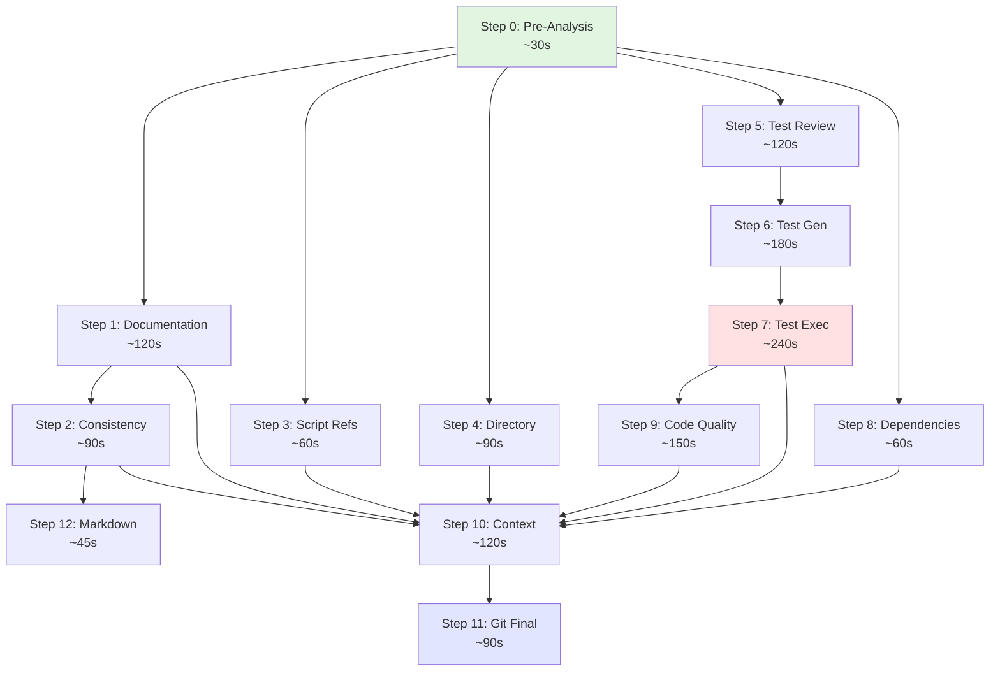

# Step Dependency Graph

**Generated:** 
2025-12-18 04:18:29

## Workflow Step Dependencies

This graph shows the dependencies between workflow steps and identifies parallelization opportunities.

## Parallelization Opportunities

### Group 1: Independent Validation (After Step 0)
Can run in parallel after Pre-Analysis completes:
- ✅ Step 1: Documentation Updates (~120s)
- ✅ Step 3: Script Reference Validation (~60s)
- ✅ Step 4: Directory Structure Validation (~90s)
- ✅ Step 5: Test Review (~120s)
- ✅ Step 8: Dependency Validation (~60s)

**Potential Time Saving:** ~270s (sequential: 450s → parallel: 180s)

### Group 2: Documentation Checks
Can run in parallel:
- ✅ Step 2: Consistency Analysis (~90s)
- ✅ Step 12: Markdown Linting (~45s)

**Potential Time Saving:** ~45s (sequential: 135s → parallel: 90s)

### Group 3: Quality Checks
Can run in parallel:
- ✅ Step 7: Test Execution (~240s)
- ✅ Step 9: Code Quality Validation (~150s)

**Potential Time Saving:** ~150s (sequential: 390s → parallel: 240s)

## Execution Time Analysis

### Current Sequential Execution
Total estimated time: **~1,395 seconds** (~23 minutes)

### With Parallelization
Estimated time: **~930 seconds** (~15.5 minutes)

**Time Savings: ~465 seconds** (~8 minutes, **33% faster**)

## Critical Path Analysis

The critical path (longest sequential chain) is:
1. Step 0: Pre-Analysis (30s)
2. Step 5: Test Review (120s)
3. Step 6: Test Generation (180s)
4. Step 7: Test Execution (240s) ⚠️ **Bottleneck**
5. Step 10: Context Analysis (120s)
6. Step 11: Git Finalization (90s)

**Critical Path Duration:** ~780 seconds (~13 minutes)

### Bottleneck Identification
- 🔴 **Step 7 (Test Execution)** is the primary bottleneck at 240s
- 🟡 **Step 6 (Test Generation)** is secondary at 180s
- 🟡 **Step 1 & 5 (AI steps)** at 120s each

## Optimization Recommendations

1. **Implement Parallel Execution** for Group 1 steps → Save ~8 minutes
2. **Optimize Test Execution** (Step 7) → Consider test sharding
3. **Cache AI Responses** → Reduce Steps 1, 5, 6, 9, 10, 11 duration
4. **Skip Redundant Steps** → Use change detection to skip unnecessary validation

---

*Generated by Step Dependency Graph Module v2.0.0*
