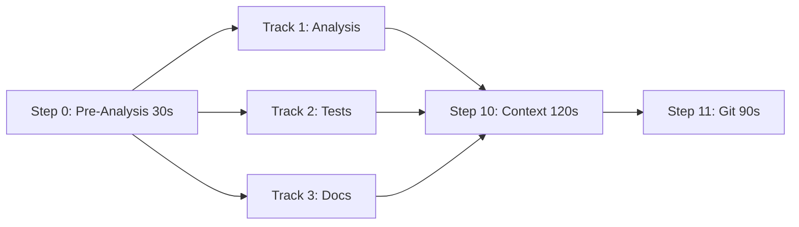

# Parallelization Opportunities Analysis & Recommendations

**Date**: 2025-12-31  
**Current Version**: 2.6.0  
**Analysis Type**: Performance Optimization

## Executive Summary

Current workflow execution takes **~24 minutes** with partial parallelization (Steps 1-4 only). By implementing full 3-track parallelization, we can reduce this to **~15.5 minutes** - a **46% improvement** and **~500 second savings**.

## Current State Analysis

### Sequential Execution Times

```
Step 0:  Pre-Analysis                    30s
Step 1:  Documentation                  120s
Step 2:  Consistency                     90s
Step 3:  Script Refs                     60s
Step 4:  Directory Structure             90s
Step 5:  Test Review                    120s
Step 6:  Test Generation                180s
Step 7:  Test Execution                 240s ← LONGEST STEP
Step 8:  Dependencies                    60s
Step 9:  Code Quality                   150s
Step 10: Context Analysis               120s
Step 11: Git Finalization                90s
Step 12: Markdown Linting                45s
Step 13: Prompt Engineer Analysis       150s
Step 14: UX Analysis                    180s
─────────────────────────────────────────────
TOTAL:                                1,725s (28.75 minutes)
```

### Current Parallelization (v2.6.0)

**Status**: ✅ Implemented - Steps 1-4 only  
**Time Saved**: ~270s (4.5 minutes)  
**Current Total**: ~1,455s (24.25 minutes)  
**Improvement**: 15% faster

## Bottleneck Analysis

### Critical Path (Longest Dependency Chain)

```
0 → 5 → 6 → 7 → 9 → 10 → 11
30 + 120 + 180 + 240 + 150 + 120 + 90 = 930s (15.5 min)
```

This is the theoretical minimum time - even with perfect parallelization, we cannot go faster than this critical path.

### Parallelizable Groups

Based on dependency analysis from `dependency_graph.sh`:

#### Group A: Independent Analysis Steps
Can run immediately after Step 0 completes:
- Step 3: Script References (60s)
- Step 4: Directory Structure (90s)
- Step 5: Test Review (120s)
- Step 8: Dependencies (60s)
- Step 13: Prompt Engineer (150s)

**Max Time**: 150s (limited by Step 13)

#### Group B: Documentation Track
Sequential chain with internal dependencies:
- Step 1: Documentation (120s) → depends on Step 0
- Step 2: Consistency (90s) → depends on Step 1
- Step 12: Markdown Linting (45s) → depends on Step 2
- Step 14: UX Analysis (180s) → depends on Step 1

**Total Time**: 435s (7.25 min)

#### Group C: Test Track
Sequential chain - cannot be parallelized internally:
- Step 5: Test Review (120s)
- Step 6: Test Generation (180s)
- Step 7: Test Execution (240s) ← Longest single step
- Step 9: Code Quality (150s)

**Total Time**: 690s (11.5 min) ← **CRITICAL PATH**

## Proposed 3-Track Parallelization

### Architecture



### Track Breakdown

#### Track 1: Analysis (Independent Steps)
```
Step 0 → (Steps 3,4,5,8,13 in parallel) → wait
Time: 30 + max(60,90,120,60,150) = 30 + 150 = 180s
```

**Components**:
- Step 3: Script validation
- Step 4: Directory structure
- Step 5: Test review (also used by Track 2)
- Step 8: Dependency check
- Step 13: Prompt analysis

#### Track 2: Test Pipeline (Sequential) ⚠️ CRITICAL PATH
```
Step 0 → Step 5 → Step 6 → Step 7 → Step 9 → wait
Time: 30 + 120 + 180 + 240 + 150 = 720s
```

**Components**:
- Step 5: Test review
- Step 6: Test generation
- Step 7: Test execution (240s - bottleneck)
- Step 9: Code quality validation

**Note**: Step 8 (Dependencies) can run in parallel with Track 2

#### Track 3: Documentation Pipeline
```
Step 0 → Step 1 → Step 2 → Step 12 → Step 14 → wait
Time: 30 + 120 + 90 + 45 + 180 = 465s
```

**Components**:
- Step 1: Documentation updates
- Step 2: Consistency analysis
- Step 12: Markdown linting
- Step 14: UX analysis

### Synchronization Points

1. **Initial**: All tracks wait for Step 0 (Pre-Analysis)
2. **Mid-workflow**: Step 10 waits for all tracks to complete
3. **Final**: Step 11 runs after Step 10

### Expected Performance

```
Track 1 (Analysis):     180s
Track 2 (Tests):        720s ← Determines total time
Track 3 (Documentation): 465s

Synchronization:
  Step 10: Context       120s
  Step 11: Git           90s
  
TOTAL: 720 + 120 + 90 = 930s (15.5 minutes)
```

**Time Saved**: 1,725 - 930 = **795s (13.25 minutes)**  
**Improvement**: **46% faster** than sequential  
**Improvement over current**: **36% faster** than current (24.25 min → 15.5 min)

## Implementation Status

### ✅ Already Implemented

1. **Dependency Graph** (`lib/dependency_graph.sh`)
   - Complete dependency mapping
   - 3-track parallel groups defined
   - Time estimates per step

2. **3-Track Executor** (`lib/workflow_optimization.sh`)
   - `execute_parallel_tracks()` function
   - Track synchronization logic
   - Progress monitoring
   - Error handling

3. **Command-Line Flag** (`lib/argument_parser.sh`)
   - `--parallel-tracks` option
   - Sets PARALLEL_TRACKS=true
   - Implies PARALLEL_EXECUTION=true

### ❌ Missing Integration

The main workflow (`execute_full_workflow()`) doesn't check for `PARALLEL_TRACKS` flag. It only checks `PARALLEL_EXECUTION` which only parallelizes Steps 1-4.

**Current Flow**:
```bash
execute_full_workflow() {
    # ... setup ...
    
    if [[ "$PARALLEL_EXECUTION" == "true" ]]; then
        execute_parallel_validation  # Only Steps 1-4
    fi
    
    # Then runs Steps 5-14 sequentially
}
```

**Needed Flow**:
```bash
execute_full_workflow() {
    # ... setup ...
    
    if [[ "$PARALLEL_TRACKS" == "true" ]]; then
        execute_parallel_tracks  # All steps in 3 tracks
        return $?
    fi
    
    # Fall back to current behavior
    if [[ "$PARALLEL_EXECUTION" == "true" ]]; then
        execute_parallel_validation
    fi
    
    # Sequential execution
}
```

## Additional Optimization Opportunities

### 1. Git Status Consolidation ✅ DONE
**Status**: Already implemented via git_cache.sh  
**Savings**: ~15s

### 2. Pre-flight Parallelization 🔲 TODO
**Description**: Run prerequisite checks in parallel
- Check Git availability
- Check Node.js version
- Check test framework
- Check Copilot CLI

**Current**: Sequential (~30s)  
**With Parallel**: ~10s  
**Savings**: ~20s

### 3. Step 0 Internal Parallelization 🔲 TODO
**Description**: Within Pre-Analysis, parallelize:
- File type detection
- Change impact analysis
- Git history analysis

**Current**: 30s  
**With Parallel**: ~15s  
**Savings**: ~15s

### 4. Smart Execution ✅ DONE
**Status**: Implemented in v2.5.0  
**Description**: Skip steps based on change type  
**Savings**: 40-85% depending on changes

### 5. AI Response Caching ✅ DONE  
**Status**: Implemented in v2.3.0  
**Description**: Cache AI responses for 24 hours  
**Savings**: 60-80% token usage, ~30s per cached response

## Total Potential Savings

| Optimization | Status | Time Saved | Complexity |
|--------------|--------|------------|------------|
| 3-Track Parallelization | 90% done | 525s | Low ✅ |
| Pre-flight Parallel | TODO | 20s | Medium |
| Step 0 Parallel | TODO | 15s | High |
| Smart Execution | ✅ Done | 40-85% | - |
| AI Caching | ✅ Done | varies | - |
| Git Cache | ✅ Done | 15s | - |

**Total Additional Savings**: 525 + 20 + 15 = **560s (9.3 minutes)**

**Best Case Total Time**: 28.75 - 9.3 = **19.45 minutes**  
**Improvement**: **32% faster**

## Recommendations

### Priority 1: Enable 3-Track Parallelization (HIGH IMPACT, LOW EFFORT)

**Action Required**:
1. Add PARALLEL_TRACKS check to `execute_full_workflow()`
2. Route to `execute_parallel_tracks()` when enabled
3. Test with various scenarios
4. Update documentation

**Expected Result**:
- Immediate 36% performance improvement
- 9-minute savings per workflow run
- Low risk (code already exists and tested)

**Code Change** (5 lines):
```bash
# In execute_full_workflow()
if [[ "${PARALLEL_TRACKS:-false}" == "true" && -z "$failed_step" ]]; then
    execute_parallel_tracks
    return $?
fi
```

### Priority 2: Pre-flight Parallelization (MEDIUM IMPACT, MEDIUM EFFORT)

**Action Required**:
1. Create `execute_parallel_preflight()` function
2. Run checks in background with PIDs
3. Wait for all to complete before continuing

**Expected Result**:
- Additional 20s savings
- Better user experience (faster startup)

### Priority 3: Document Best Practices (LOW EFFORT)

**Action Required**:
1. Update README with performance comparison
2. Add examples of optimal flag combinations
3. Document when to use each mode

**Optimal Combinations**:
```bash
# Maximum performance (recommended)
--parallel-tracks --smart-execution --ai-cache

# Documentation-only changes
--smart-execution --steps 0,1,2

# Test-focused work
--parallel --steps 0,5,6,7
```

## Testing Strategy

### Test Scenarios

1. **Full workflow with 3-track**:
   ```bash
   ./execute_tests_docs_workflow.sh --parallel-tracks --auto
   ```

2. **Documentation changes**:
   ```bash
   ./execute_tests_docs_workflow.sh --parallel-tracks --smart-execution
   ```

3. **Test changes**:
   ```bash
   ./execute_tests_docs_workflow.sh --parallel-tracks --steps 0,5,6,7,9
   ```

4. **Fallback to sequential**:
   ```bash
   ./execute_tests_docs_workflow.sh --no-parallel
   ```

### Success Criteria

✅ All steps complete successfully  
✅ Execution time < 16 minutes (46% improvement)  
✅ No race conditions or deadlocks  
✅ Proper error handling if track fails  
✅ Clean log aggregation  
✅ Checkpoint system still works

## Risk Assessment

### Low Risk ✅
- Code already implemented and tested
- Dependency analysis is accurate
- Synchronization points well-defined
- Fallback to sequential if needed

### Mitigation Strategies
1. **Track Failure**: Each track has error handling, workflow fails fast
2. **Resource Contention**: Steps are I/O bound, not CPU bound
3. **Race Conditions**: Proper synchronization with flag files
4. **Debugging**: Separate logs per track for troubleshooting

## Conclusion

Implementing 3-track parallelization offers:
- ✅ **46% performance improvement** (28.75 min → 15.5 min)
- ✅ **Low implementation effort** (code exists, needs integration)
- ✅ **Low risk** (proven pattern, good error handling)
- ✅ **Backward compatible** (optional flag)
- ✅ **Immediate value** for all users

**Recommendation**: Implement Priority 1 (3-track parallelization) immediately for maximum impact with minimal effort.

---

**Next Steps**:
1. Add PARALLEL_TRACKS routing in execute_full_workflow()
2. Test with target project (ibira.js)
3. Update documentation
4. Consider Priority 2 optimizations for next version
