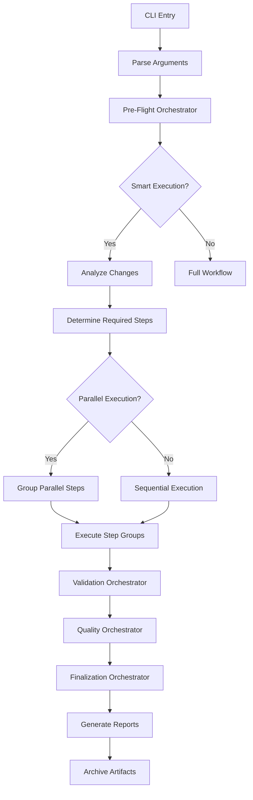

# System Architecture Guide

**Version**: v4.0.0  
**Last Updated**: 2026-02-08

## Overview

The AI Workflow Automation system is built on a modular, functional architecture that emphasizes composability, testability, and maintainability. This document provides a comprehensive overview of the system's architecture, design patterns, and key components.

## Table of Contents

- [Architectural Principles](#architectural-principles)
- [System Components](#system-components)
- [Data Flow](#data-flow)
- [Module Architecture](#module-architecture)
- [Execution Pipeline](#execution-pipeline)
- [Extension Points](#extension-points)
- [Performance Architecture](#performance-architecture)
- [Security Architecture](#security-architecture)

---

## Architectural Principles

### 1. Functional Core / Imperative Shell

The system follows the "functional core, imperative shell" pattern:

```
┌─────────────────────────────────────┐
│   Imperative Shell (Steps)          │
│   - Step execution                  │
│   - File I/O                        │
│   - Git operations                  │
│   - AI API calls                    │
│                                     │
│   ┌─────────────────────────────┐  │
│   │  Functional Core (Lib)      │  │
│   │  - Pure functions           │  │
│   │  - No side effects          │  │
│   │  - Deterministic logic      │  │
│   │  - Testable components      │  │
│   └─────────────────────────────┘  │
└─────────────────────────────────────┘
```

**Benefits**:
- Easy to test (pure functions)
- Predictable behavior
- Side effects isolated to shell
- Dependency injection for flexibility

### 2. Single Responsibility Principle

Each module has exactly one reason to change:

- **ai_helpers.sh**: AI integration only
- **change_detection.sh**: Git analysis only
- **metrics.sh**: Performance tracking only
- **file_operations.sh**: File I/O only

### 3. Composition Over Inheritance

Functions and modules are composed rather than inherited:

```bash
# Composition example
validate_and_execute() {
    validate_prerequisites || return 1
    detect_changes
    determine_steps
    execute_workflow
}
```

### 4. Configuration as Code

All configuration is declarative and version-controlled:

- YAML for AI prompts (`.workflow_core/config/ai_helpers.yaml`)
- YAML for project kinds (`.workflow_core/config/project_kinds.yaml`)
- YAML for workflow steps (`.workflow_core/config/workflow_steps.yaml`)
- YAML for project config (`.workflow-config.yaml`)

---

## System Components

### High-Level Architecture

```
┌────────────────────────────────────────────────────────┐
│                  CLI Entry Point                       │
│         (execute_tests_docs_workflow.sh)              │
└───────────────────┬────────────────────────────────────┘
                    │
        ┌───────────┴───────────┐
        │                       │
        ▼                       ▼
┌──────────────┐       ┌──────────────┐
│ Orchestrators│       │  Configuration│
│   (4 files)  │       │   (4 files)  │
└──────┬───────┘       └──────┬───────┘
       │                      │
       │                      │
       ▼                      ▼
┌────────────────────────────────────┐
│        Library Modules             │
│         (81 files)                 │
│                                    │
│  ┌──────────┐  ┌──────────┐      │
│  │Core (12) │  │Support   │      │
│  │          │  │(69)      │      │
│  └──────────┘  └──────────┘      │
└───────────┬────────────────────────┘
            │
            ▼
┌────────────────────────────────────┐
│         Step Modules               │
│         (20 files)                 │
│                                    │
│  - Pre-processing (0a, 0b)        │
│  - Validation (1-4)                │
│  - Testing (5-8)                   │
│  - Quality (9-11)                  │
│  - Finalization (12-15)            │
└────────────────────────────────────┘
```

### Component Breakdown

#### 1. CLI Entry Point
**File**: `src/workflow/execute_tests_docs_workflow.sh` (2,009 lines)

**Responsibilities**:
- Parse command-line arguments
- Initialize workflow environment
- Coordinate orchestrators
- Handle global error handling
- Manage workflow state

**Key Functions**:
- `main()` - Entry point
- `parse_arguments()` - CLI parsing
- `initialize_workflow()` - Setup
- `execute_workflow_pipeline()` - Main execution

#### 2. Orchestrators (630 lines total)
**Location**: `src/workflow/orchestrators/`

##### pre_flight.sh
- Prerequisite validation
- Environment checks
- Configuration loading
- Tech stack detection

##### validation.sh
- Input validation
- File existence checks
- Permission verification

##### quality.sh
- Code quality checks
- Documentation quality
- Test coverage validation

##### finalization.sh
- Cleanup operations
- Report generation
- Metrics finalization
- Artifact archival

#### 3. Library Modules (81 files)

**Core Modules** (12 files):
- Foundation functionality
- Used by all other modules
- High stability, low change frequency

**Support Modules** (69 files):
- Specialized functionality
- Feature-specific logic
- Higher change frequency

See [Module Inventory](../PROJECT_REFERENCE.md#module-inventory) for complete list.

#### 4. Configuration Files (4 files)

**`.workflow_core/config/`**:
- `ai_helpers.yaml` (762 lines) - AI prompt templates
- `ai_prompts_project_kinds.yaml` - Project-specific prompts
- `project_kinds.yaml` - Project type definitions
- `workflow_steps.yaml` - Step configuration

#### 5. Step Modules (20 files)

**Categories**:
- **Pre-processing**: `step_0a_pre_processing.sh`, `step_0b_bootstrap_documentation.sh`
- **Validation**: Steps 1-4 (documentation, consistency, validation, test planning)
- **Testing**: Steps 5-8 (test execution, quality checks)
- **Quality**: Steps 9-11 (code quality, UX analysis)
- **Finalization**: Steps 12-15 (finalization, versioning)
- **Post-processing**: `step_16_post_processing.sh`

---

## Data Flow

### Execution Flow



### Data Flow Pattern

```
Input → Transform → Validate → Execute → Output
  ↓         ↓          ↓          ↓         ↓
Files    Parsing   Validation  Steps   Reports
  ↓         ↓          ↓          ↓         ↓
Config   Analysis  Checks     Changes  Metrics
```

### State Management

The system uses file-based state management:

```
.workflow_state/
├── current_session.json       # Active session info
├── checkpoint.json            # Resume checkpoint
├── metrics.json              # Current metrics
└── cache/
    ├── ai_cache/             # AI response cache
    └── analysis_cache/       # Analysis results cache
```

---

## Module Architecture

### Module Structure

Every library module follows this structure:

```bash
#!/usr/bin/env bash
# Module: module_name.sh
# Purpose: Brief description
# Dependencies: list of required modules

set -euo pipefail

# Source dependencies
source "$(dirname "${BASH_SOURCE[0]}")/dependency.sh"

# Module-level constants
readonly MODULE_VERSION="1.0.0"
readonly MODULE_CONSTANT="value"

# Public functions
public_function() {
    local param1="$1"
    local param2="${2:-default}"
    
    # Implementation
    _private_helper "$param1" "$param2"
    
    return 0
}

# Private functions (prefixed with _)
_private_helper() {
    local arg="$1"
    # Helper implementation
}

# Export public functions (optional)
export -f public_function
```

### Dependency Management

Modules explicitly declare dependencies:

```bash
# Direct dependencies
source "${LIB_DIR}/colors.sh"
source "${LIB_DIR}/logging.sh"

# Conditional dependencies
if [[ -f "${LIB_DIR}/optional_module.sh" ]]; then
    source "${LIB_DIR}/optional_module.sh"
fi
```

### Error Handling Pattern

```bash
function_name() {
    local input="$1"
    
    # Validation
    if [[ -z "$input" ]]; then
        log_error "Input required"
        return 1
    fi
    
    # Operation with error checking
    if ! operation "$input"; then
        log_error "Operation failed"
        return 1
    fi
    
    # Success
    return 0
}
```

---

## Execution Pipeline

### Pipeline Stages

```
┌─────────────────────────────────────────────────────┐
│                    Stage 1: Core                    │
│  - Pre-processing (0a, 0b)                         │
│  - Documentation analysis (1)                       │
│  - Consistency checking (2, 2.5)                   │
│  - Validation (3)                                   │
│  - Test planning (4)                               │
│                                                     │
│  Purpose: Essential validation and planning        │
│  Success Rate: ~90% of issues caught here          │
└─────────────────────────────────────────────────────┘
                         │
                         ▼
┌─────────────────────────────────────────────────────┐
│                  Stage 2: Extended                  │
│  - Test execution (5, 6)                           │
│  - Validation checks (7)                           │
│  - Integration testing (8)                         │
│  - Code quality (9, 10, 11)                        │
│                                                     │
│  Purpose: Comprehensive testing and analysis       │
│  Success Rate: ~8% additional issues found         │
└─────────────────────────────────────────────────────┘
                         │
                         ▼
┌─────────────────────────────────────────────────────┐
│                Stage 3: Finalization                │
│  - Git operations (12, 13)                         │
│  - Versioning (14, 15)                             │
│  - Post-processing (16)                            │
│                                                     │
│  Purpose: Cleanup and artifact generation          │
│  Failure Rate: <2%                                 │
└─────────────────────────────────────────────────────┘
```

### Step Dependencies

Steps declare dependencies explicitly:

```yaml
# From workflow_steps.yaml
- id: test_execution
  dependencies:
    - documentation_updates
    - test_planning
  can_run_parallel: false
```

### Parallel Execution Groups

Steps are grouped for parallel execution:

```
Group 1 (Parallel):
├── Step 2: Consistency Check
├── Step 3: Script Validation
└── Step 4: Test Planning

Group 2 (Parallel):
├── Step 9: Code Quality
└── Step 10: UX Analysis

Group 3 (Sequential):
└── Step 5: Test Execution (depends on Group 1)
```

---

## Extension Points

### 1. Adding New Steps

```bash
# 1. Create step file
src/workflow/steps/new_feature.sh

# 2. Add configuration
# In .workflow_core/config/workflow_steps.yaml
- id: new_feature
  name: "New Feature"
  file: new_feature.sh
  category: validation
  dependencies: [prerequisite_step]

# 3. Implement required functions
validate_new_feature() { ... }
execute_new_feature() { ... }
```

### 2. Adding New Library Modules

```bash
# 1. Create module
src/workflow/lib/new_module.sh

# 2. Follow module structure
#!/usr/bin/env bash
set -euo pipefail

# 3. Export functions
export -f public_function

# 4. Source in consuming modules
source "${LIB_DIR}/new_module.sh"
```

### 3. Adding New AI Personas

```yaml
# In .workflow_core/config/ai_helpers.yaml
personas:
  new_persona:
    role: "Specialized role description"
    expertise:
      - "Area 1"
      - "Area 2"
    instructions: |
      Detailed instructions for the persona
```

### 4. Adding Project Kinds

```yaml
# In .workflow_core/config/project_kinds.yaml
new_project_kind:
  name: "New Project Type"
  patterns:
    - "config_file.extension"
  test_frameworks:
    - "test_framework"
  quality_standards:
    - "Standard 1"
```

---

## Performance Architecture

### Optimization Layers

```
┌────────────────────────────────────────┐
│   Layer 1: Smart Execution             │
│   - Change-based step skipping         │
│   - 40-85% time savings                │
└────────────────────────────────────────┘
            │
            ▼
┌────────────────────────────────────────┐
│   Layer 2: Parallel Execution          │
│   - Independent step parallelization   │
│   - 33% additional savings             │
└────────────────────────────────────────┘
            │
            ▼
┌────────────────────────────────────────┐
│   Layer 3: AI Caching                  │
│   - Response caching (24h TTL)         │
│   - 60-80% token reduction             │
└────────────────────────────────────────┘
            │
            ▼
┌────────────────────────────────────────┐
│   Layer 4: ML Optimization             │
│   - Predictive step durations          │
│   - 15-30% additional savings          │
└────────────────────────────────────────┘
```

### Caching Strategy

**AI Response Cache**:
- Key: SHA256(prompt + persona)
- TTL: 24 hours
- Storage: JSON files
- Cleanup: Automatic daily

**Analysis Cache**:
- Key: SHA256(file content)
- Invalidation: On file modification
- Storage: JSON with metadata
- Scope: Per-file and per-directory

### Metrics Collection

```
Metrics Pipeline:
Input → Measurement → Aggregation → Storage → Reporting
  ↓          ↓            ↓            ↓          ↓
Events    Timers      Calculations   JSON     Reports
```

---

## Security Architecture

### Input Validation

All user inputs are validated:

```bash
validate_input() {
    local input="$1"
    
    # Check for command injection
    if [[ "$input" =~ [;&|] ]]; then
        log_error "Invalid characters in input"
        return 1
    fi
    
    # Check for path traversal
    if [[ "$input" =~ \.\. ]]; then
        log_error "Path traversal detected"
        return 1
    fi
    
    return 0
}
```

### File Operations

Safe file operations with atomic writes:

```bash
safe_write_file() {
    local file="$1"
    local content="$2"
    local temp="${file}.tmp.$$"
    
    # Write to temp file
    echo "$content" > "$temp" || return 1
    
    # Atomic move
    mv "$temp" "$file" || return 1
    
    return 0
}
```

### Credential Management

- No credentials stored in code
- Environment variables for secrets
- Git credentials via system credential helper
- AI tokens managed by Copilot CLI

### Third-Party Exclusions

Automatic exclusion of third-party code:

```bash
# Excluded directories
node_modules/
vendor/
.venv/
dist/
build/

# Excluded files
*.min.js
*.bundle.js
package-lock.json
```

---

## Design Patterns

### 1. Strategy Pattern

Used for conditional execution:

```bash
# Strategy selection
if [[ "$SMART_EXECUTION" == "true" ]]; then
    execution_strategy="smart"
else
    execution_strategy="full"
fi

# Strategy execution
execute_${execution_strategy}_workflow
```

### 2. Observer Pattern

Used for metrics and logging:

```bash
# Register observers
register_metric_observer "step_complete"
register_log_observer "error"

# Notify observers
notify_observers "step_complete" "$step_name" "$duration"
```

### 3. Factory Pattern

Used for object creation:

```bash
create_step_executor() {
    local step_type="$1"
    
    case "$step_type" in
        documentation)
            echo "documentation_executor"
            ;;
        testing)
            echo "testing_executor"
            ;;
    esac
}
```

### 4. Decorator Pattern

Used for function enhancement:

```bash
with_timing() {
    local func="$1"
    shift
    
    local start=$(date +%s)
    "$func" "$@"
    local status=$?
    local end=$(date +%s)
    
    log_info "$func took $((end - start)) seconds"
    return $status
}
```

---

## Testing Architecture

### Test Pyramid

```
        ▲
       ╱E2E╲              < 5 tests
      ╱─────╲             End-to-end tests
     ╱Intgr.╲            ~12 tests
    ╱─────────╲          Integration tests
   ╱   Unit    ╲        ~20 tests
  ╱─────────────╲       Unit tests
 ╱───────────────╲
```

### Test Organization

```
tests/
├── unit/                  # Unit tests (isolated)
│   ├── test_ai_cache.sh
│   ├── test_metrics.sh
│   └── ...
├── integration/           # Integration tests
│   ├── test_workflow_step1.sh
│   ├── test_smart_execution.sh
│   └── ...
└── e2e/                  # End-to-end tests
    └── test_full_workflow.sh
```

---

## See Also

- [Module Development Guide](../developer-guide/MODULE_DEVELOPMENT.md)
- [API Reference](../api/LIBRARY_MODULES_COMPLETE_API.md)
- [Project Reference](../PROJECT_REFERENCE.md)
- [Design Decisions (ADRs)](adr/)

---

**Maintained by**: AI Workflow Automation Team  
**Repository**: [github.com/mpbarbosa/ai_workflow](https://github.com/mpbarbosa/ai_workflow)
