# AI Workflow Automation - Visual Architecture Guide

**Version**: 4.0.1  
**Last Updated**: 2026-02-10  
**Purpose**: Visual representation of system architecture, component relationships, and data flows

> 📋 **Companion Documents**:
> - [PROJECT_REFERENCE.md](../PROJECT_REFERENCE.md) - Project statistics and features
> - [COMPREHENSIVE_ARCHITECTURE_GUIDE.md](COMPREHENSIVE_ARCHITECTURE_GUIDE.md) - Detailed architecture
> - [SCRIPT_REFERENCE.md](../../src/workflow/SCRIPT_REFERENCE.md) - Script API reference

---

## Table of Contents

1. [System Overview](#system-overview)
2. [High-Level Architecture](#high-level-architecture)
3. [Module Architecture](#module-architecture)
4. [Workflow Pipeline](#workflow-pipeline)
5. [AI Integration Architecture](#ai-integration-architecture)
6. [Data Flow Diagrams](#data-flow-diagrams)
7. [Performance Optimization Flow](#performance-optimization-flow)
8. [Dependency Graph](#dependency-graph)

---

## System Overview

### Component Hierarchy

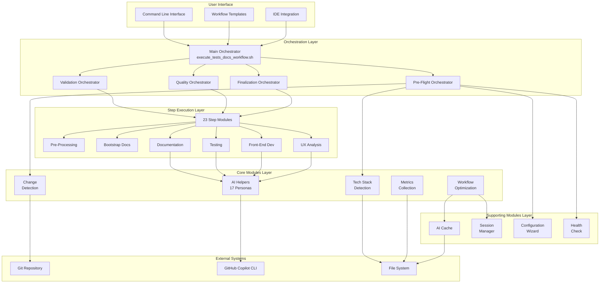

---

## High-Level Architecture

### System Layers

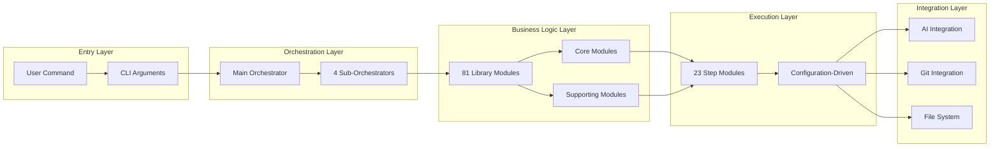

### Architecture Principles

1. **Functional Core / Imperative Shell**
   - Pure functions in library modules
   - Side effects isolated to step execution
   - Testable and composable

2. **Single Responsibility**
   - Each module has one clear purpose
   - Clean separation of concerns
   - Modular design

3. **Configuration as Code**
   - YAML-based configuration
   - Centralized management
   - Environment overrides

---

## Module Architecture

### Module Organization

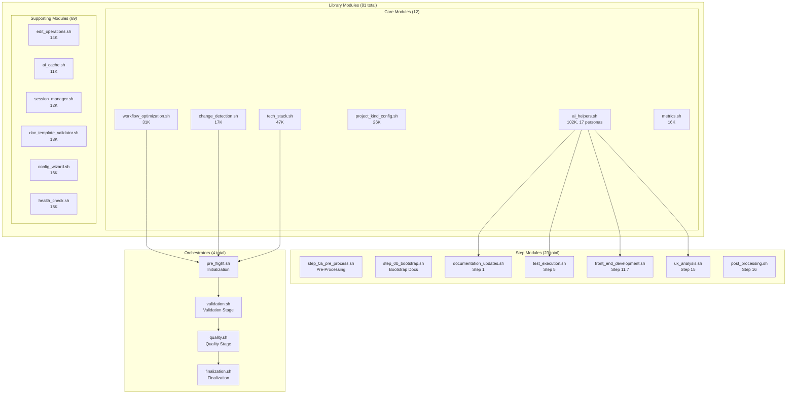

---

## Workflow Pipeline

### 23-Step Pipeline Flow

```mermaid
graph TD
    Start([Start Workflow]) --> PreFlight[Pre-Flight Checks]
    
    PreFlight --> Step0a[Step 0a: Pre-Processing<br/>Initialize environment]
    Step0a --> Step0b[Step 0b: Bootstrap Docs<br/>Generate missing docs]
    
    Step0b --> Stage1{Multi-Stage<br/>Pipeline?}
    
    Stage1 -->|Stage 1: Core| Step00[Step 0: Change Analysis]
    Step00 --> Step01[Step 1: Documentation Updates]
    Step01 --> Step02[Step 2: Documentation Analysis]
    Step02 --> Step02_5[Step 2.5: Doc Optimization]
    Step02_5 --> Step03[Step 3: Documentation Review]
    
    Step03 --> Check1{Smart<br/>Execution?}
    Check1 -->|Skip| Stage2
    Check1 -->|Run| Step04[Step 4: Test Review]
    
    Step04 --> Stage2{Continue to<br/>Stage 2?}
    
    Stage2 -->|Stage 2: Extended| Step05[Step 5: Test Execution]
    Step05 --> Step06[Step 6: Coverage Analysis]
    Step06 --> Step07[Step 7: Test Generation]
    Step07 --> Step08[Step 8: Code Quality]
    
    Step08 --> Check2{Smart<br/>Execution?}
    Check2 -->|Skip| Stage3
    Check2 -->|Run| Step09[Step 9: Security Check]
    
    Step09 --> Step10[Step 10: Performance]
    Step10 --> Step11[Step 11: Source Code]
    Step11 --> Step11_7[Step 11.7: Front-End Dev]
    
    Step11_7 --> Stage3{Continue to<br/>Stage 3?}
    
    Stage3 -->|Stage 3: Finalization| Step12[Step 12: Final Review]
    Step12 --> Step13[Step 13: Integration]
    Step13 --> Step14[Step 14: Change Summary]
    Step14 --> Step15[Step 15: UX Analysis]
    Step15 --> Step16[Step 16: Post-Processing]
    Step16 --> Step17[Step 17: Git Finalization]
    
    Step17 --> Checkpoint{Checkpoint<br/>Success?}
    Checkpoint -->|Yes| Metrics[Collect Metrics]
    Checkpoint -->|Fail| Resume[Resume Available]
    
    Metrics --> Complete([Workflow Complete])
    Resume -.->|Next Run| Step00
    
    style Step0a fill:#e1f5ff
    style Step0b fill:#e1f5ff
    style Step01 fill:#ffe1e1
    style Step05 fill:#fff4e1
    style Step11_7 fill:#e1ffe1
    style Step15 fill:#f0e1ff
    style Step17 fill:#e1e1ff
```

### Stage-Based Execution

```mermaid
graph LR
    subgraph "Stage 1: Core Validation"
        S1_1[Change Analysis]
        S1_2[Documentation<br/>Updates]
        S1_3[Doc Analysis]
        S1_4[Doc Review]
    end
    
    subgraph "Stage 2: Extended Validation"
        S2_1[Test Execution]
        S2_2[Coverage<br/>Analysis]
        S2_3[Test Generation]
        S2_4[Code Quality]
        S2_5[Security]
        S2_6[Performance]
        S2_7[Source Code]
        S2_8[Front-End Dev]
    end
    
    subgraph "Stage 3: Finalization"
        S3_1[Final Review]
        S3_2[Integration]
        S3_3[Change Summary]
        S3_4[UX Analysis]
        S3_5[Post-Processing]
        S3_6[Git Finalization]
    end
    
    S1_1 --> S1_2
    S1_2 --> S1_3
    S1_3 --> S1_4
    
    S1_4 -->|Continue?| S2_1
    
    S2_1 --> S2_2
    S2_2 --> S2_3
    S2_3 --> S2_4
    S2_4 --> S2_5
    S2_5 --> S2_6
    S2_6 --> S2_7
    S2_7 --> S2_8
    
    S2_8 -->|Continue?| S3_1
    
    S3_1 --> S3_2
    S3_2 --> S3_3
    S3_3 --> S3_4
    S3_4 --> S3_5
    S3_5 --> S3_6
    
    style S1_1 fill:#ffe1e1
    style S1_2 fill:#ffe1e1
    style S1_3 fill:#ffe1e1
    style S1_4 fill:#ffe1e1
    
    style S2_1 fill:#fff4e1
    style S2_2 fill:#fff4e1
    style S2_3 fill:#fff4e1
    style S2_4 fill:#fff4e1
    style S2_5 fill:#fff4e1
    style S2_6 fill:#fff4e1
    style S2_7 fill:#fff4e1
    style S2_8 fill:#fff4e1
    
    style S3_1 fill:#e1ffe1
    style S3_2 fill:#e1ffe1
    style S3_3 fill:#e1ffe1
    style S3_4 fill:#e1ffe1
    style S3_5 fill:#e1ffe1
    style S3_6 fill:#e1ffe1
```

---

## AI Integration Architecture

### AI Persona System

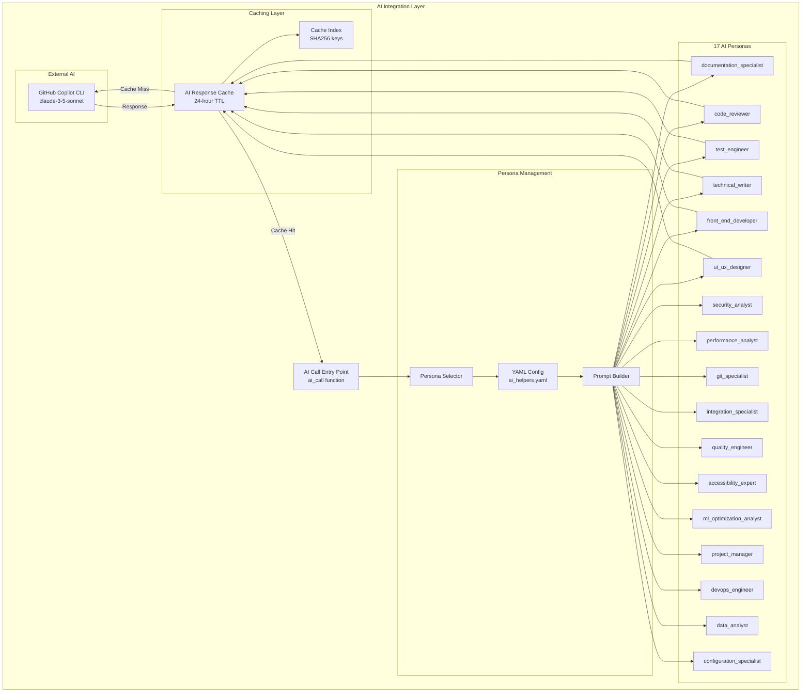

### AI Request Flow

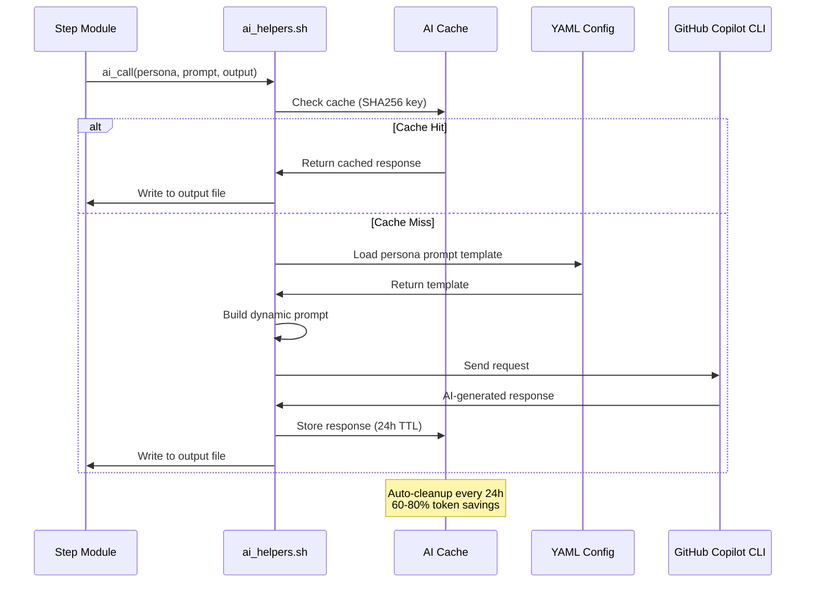

---

## Data Flow Diagrams

### Configuration Flow

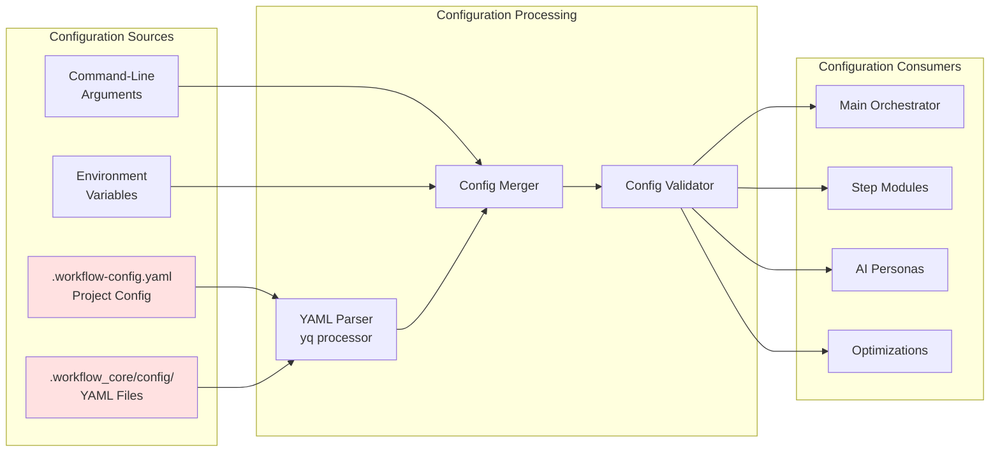

### Change Detection Flow

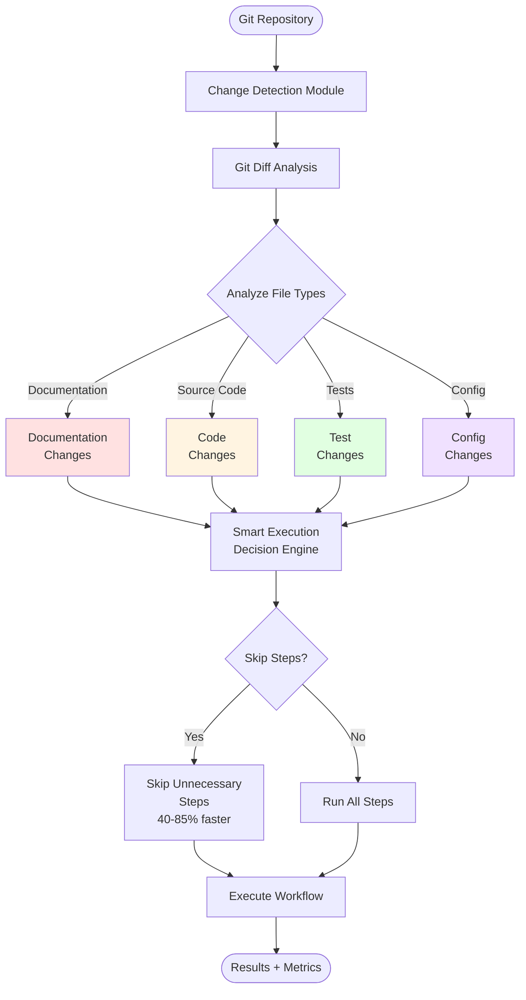

### Metrics Collection Flow

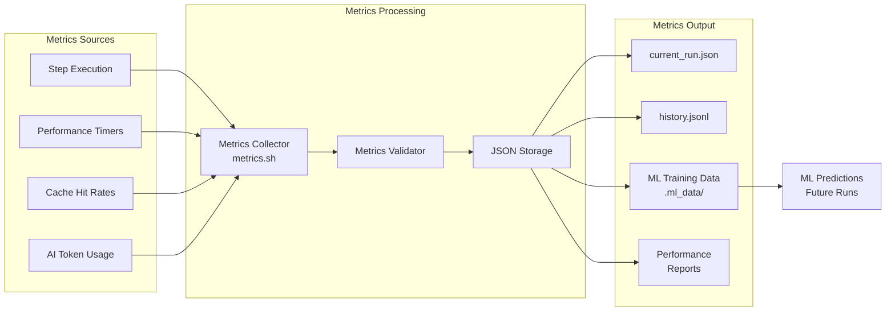

---

## Performance Optimization Flow

### Optimization Decision Tree

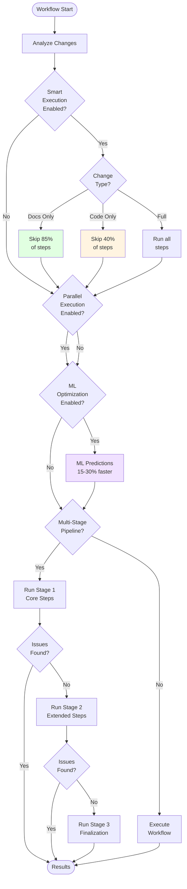

### Performance Gains Breakdown

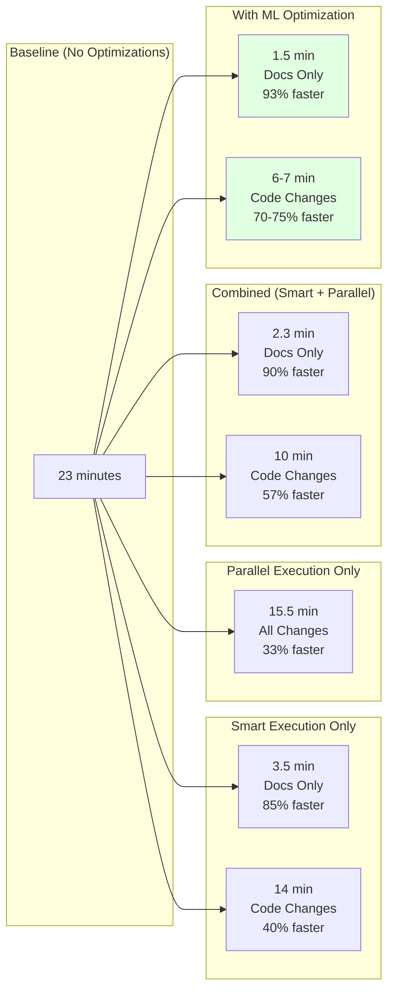

---

## Dependency Graph

### Module Dependencies

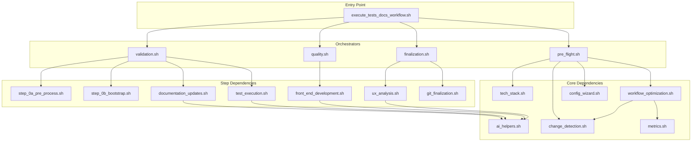

### Step Execution Dependencies

```mermaid
graph TD
    Step0a[Step 0a: Pre-Process] --> Step0b[Step 0b: Bootstrap]
    Step0b --> Step0[Step 0: Analysis]
    
    Step0 --> Step1[Step 1: Docs Update]
    Step1 --> Step2[Step 2: Docs Analysis]
    Step2 --> Step2_5[Step 2.5: Optimize]
    Step2_5 --> Step3[Step 3: Docs Review]
    
    Step3 --> Step4[Step 4: Test Review]
    Step4 --> Step5[Step 5: Test Execution]
    Step5 --> Step6[Step 6: Coverage]
    Step6 --> Step7[Step 7: Test Gen]
    
    Step7 --> Step8[Step 8: Quality]
    Step8 --> Step9[Step 9: Security]
    Step9 --> Step10[Step 10: Performance]
    Step10 --> Step11[Step 11: Source]
    Step11 --> Step11_7[Step 11.7: Front-End]
    
    Step11_7 --> Step12[Step 12: Final Review]
    Step12 --> Step13[Step 13: Integration]
    Step13 --> Step14[Step 14: Summary]
    Step14 --> Step15[Step 15: UX]
    Step15 --> Step16[Step 16: Post-Process]
    Step16 --> Step17[Step 17: Git Final]
    
    style Step0a fill:#e1f5ff
    style Step0b fill:#e1f5ff
    style Step1 fill:#ffe1e1
    style Step5 fill:#fff4e1
    style Step11_7 fill:#e1ffe1
    style Step15 fill:#f0e1ff
    style Step17 fill:#e1e1ff
```

---

## Architecture Patterns

### Functional Core / Imperative Shell

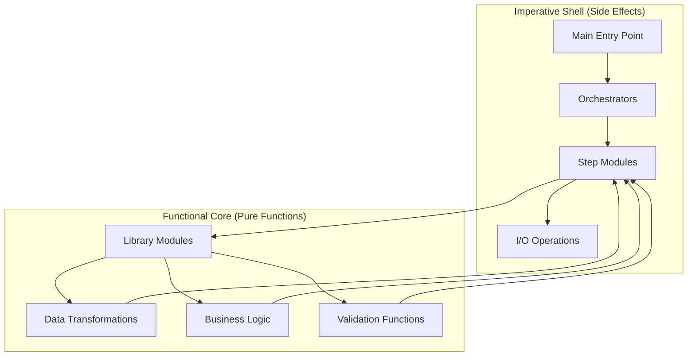

### Module Communication Pattern

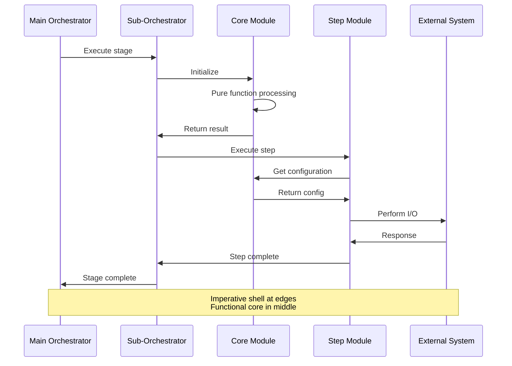

---

## Summary

This visual architecture guide provides:

1. **System Overview**: Component hierarchy and relationships
2. **High-Level Architecture**: System layers and principles
3. **Module Architecture**: Organization of 111 total modules
4. **Workflow Pipeline**: 23-step execution flow with stages
5. **AI Integration**: 17 personas and caching system
6. **Data Flows**: Configuration, change detection, metrics
7. **Performance**: Optimization decision tree and gains
8. **Dependencies**: Module and step relationships

**Key Takeaways**:
- Modular design with clear separation of concerns
- Functional core with imperative shell pattern
- Configuration-driven workflow execution
- Multi-stage progressive validation
- AI-powered analysis with caching
- Performance optimizations achieve 93% speed improvement

**Related Documentation**:
- [COMPREHENSIVE_ARCHITECTURE_GUIDE.md](COMPREHENSIVE_ARCHITECTURE_GUIDE.md) - Detailed architecture
- [../PROJECT_REFERENCE.md](../PROJECT_REFERENCE.md) - Project statistics
- [../../src/workflow/SCRIPT_REFERENCE.md](../../src/workflow/SCRIPT_REFERENCE.md) - Script API
- [../reference/workflow-diagrams.md](../reference/workflow-diagrams.md) - Additional diagrams

---

**Last Updated**: 2026-02-10  
**Maintainer**: Marcelo Pereira Barbosa ([@mpbarbosa](https://github.com/mpbarbosa))
