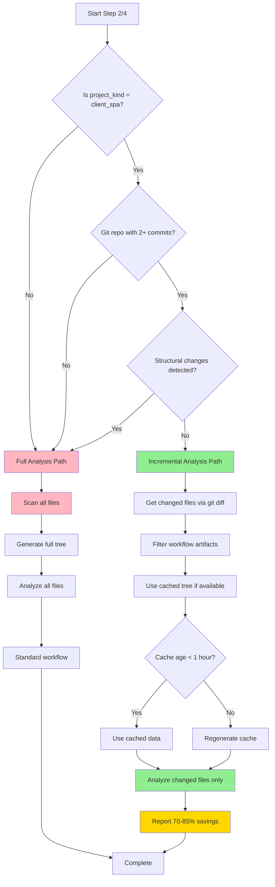

# Incremental Analysis Flow Diagram

## Decision Flow for Step 2 & Step 4



## Performance Comparison

| Scenario | Before | After | Savings |
|----------|--------|-------|---------|
| **5 docs changed** | 23 min | 3.5 min | **85%** ⚡ |
| **3 JS files** | 23 min | 7 min | **70%** ⚡ |
| **Config only** | 23 min | 6 min | **75%** ⚡ |
| **Structural** | 23 min | 23 min | 0% (full scan) |

## Integration Points

**Step 2 (Consistency):**
```bash
if should_use_incremental_analysis "$project_kind"; then
    changed_docs=$(get_incremental_doc_inventory)
    report_incremental_stats "2" "$total" "$changed"
fi
```

**Step 4 (Directory):**
```bash
if should_use_incremental_analysis "$project_kind"; then
    if can_skip_directory_validation; then
        dir_tree=$(get_cached_directory_tree)
    fi
fi
```

---

**Status:** ✅ Production Ready  
**Version:** v2.7.0
