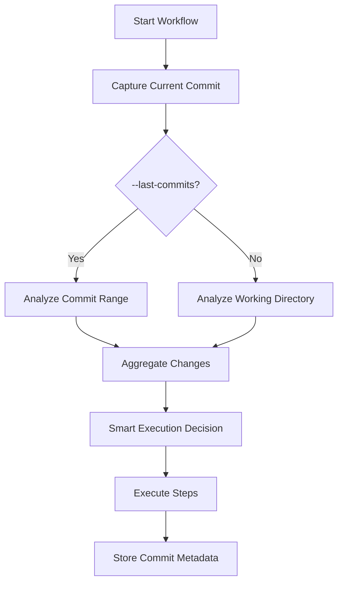

# Git Commit Tracking Guide

**Version**: 4.0.1  
**Feature Version**: v3.3.0  
**Last Updated**: 2026-02-09

> 📝 **Purpose**: Track and analyze Git commit history in workflow execution

## Table of Contents

- [Overview](#overview)
- [Quick Start](#quick-start)
- [How It Works](#how-it-works)
- [Use Cases](#use-cases)
- [Configuration](#configuration)
- [Commit Hash Storage](#commit-hash-storage)
- [Integration Examples](#integration-examples)
- [Querying Commit Data](#querying-commit-data)
- [Best Practices](#best-practices)

---

## Overview

Git Commit Tracking (introduced in v3.3.0) enables the workflow to:

- **Track commit hashes** for each workflow run
- **Analyze multiple commits** for comprehensive change detection
- **Associate workflow results** with specific Git history
- **Enable audit trails** for compliance and debugging
- **Support release validation** across commit ranges

**Key Features**:
- Automatic hash capture on every run
- Multi-commit analysis with `--last-commits N`
- Integration with `--validate-release` flag
- Stored in workflow metadata
- Queryable via CLI tools

---

## Quick Start

### Basic Usage

```bash
# Default: Analyze current uncommitted changes
./src/workflow/execute_tests_docs_workflow.sh

# Analyze last 5 commits
./src/workflow/execute_tests_docs_workflow.sh --last-commits 5

# Validate last 10 commits before release
./src/workflow/execute_tests_docs_workflow.sh \
  --last-commits 10 \
  --validate-release \
  --auto
```

### View Tracked Commits

```bash
# Show commits from last run
cat src/workflow/backlog/latest/commit_hashes.json

# Output:
{
  "workflow_id": "workflow_20260209_184530",
  "start_commit": "a1b2c3d",
  "end_commit": "x9y8z7w",
  "commit_count": 5,
  "commits": [
    {
      "hash": "x9y8z7w",
      "date": "2026-02-09T18:45:00Z",
      "message": "feat: add new feature"
    },
    ...
  ]
}
```

---

## How It Works

### 1. Commit Hash Capture

The workflow automatically captures:

- **HEAD commit hash** - Current commit at execution start
- **Uncommitted changes** - Working directory modifications
- **Commit range** (with `--last-commits`) - Historical commits

### 2. Storage Location

Commit data stored in multiple locations:

```
src/workflow/
├── backlog/
│   └── workflow_YYYYMMDD_HHMMSS/
│       ├── commit_hashes.json       # Detailed commit info
│       └── EXECUTION_SUMMARY.md     # Summary with commits
├── metrics/
│   └── current_run.json             # Includes commit hashes
└── .git_commit_cache/               # Internal cache
```

### 3. Change Detection Integration



---

## Use Cases

### 1. Feature Branch Validation

Validate all changes in feature branch:

```bash
# Count commits in feature branch
COMMITS=$(git rev-list --count main..HEAD)

# Validate all changes
./src/workflow/execute_tests_docs_workflow.sh \
  --last-commits $COMMITS \
  --smart-execution \
  --auto
```

### 2. Pre-Release Validation

Validate multiple commits before release:

```bash
# Validate last 20 commits
./src/workflow/execute_tests_docs_workflow.sh \
  --last-commits 20 \
  --validate-release \
  --auto
```

### 3. Post-Rebase Testing

Test changes after rebase:

```bash
# After rebasing 10 commits
git rebase -i HEAD~10

# Validate rebased commits
./src/workflow/execute_tests_docs_workflow.sh \
  --last-commits 10 \
  --auto
```

### 4. Audit Trail

Track which commits were validated:

```bash
# Run workflow
./src/workflow/execute_tests_docs_workflow.sh

# Query audit trail
./scripts/query_workflow_commits.sh --workflow-id workflow_20260209_184530

# Output: List of validated commits with results
```

### 5. CI/CD Integration

Validate commit ranges in CI:

```yaml
# GitHub Actions
- name: Validate Commits
  run: |
    COMMIT_COUNT=$(git rev-list --count ${{ github.event.before }}..${{ github.sha }})
    ./src/workflow/execute_tests_docs_workflow.sh \
      --last-commits $COMMIT_COUNT \
      --auto
```

---

## Configuration

### Environment Variables

```bash
# Enable commit tracking (default: true)
export GIT_COMMIT_TRACKING_ENABLED=true

# Set commit analysis depth
export GIT_ANALYSIS_DEPTH=10

# Include uncommitted changes (default: true)
export INCLUDE_UNCOMMITTED=true
```

### Configuration File

Add to `.workflow-config.yaml`:

```yaml
git:
  commit_tracking:
    enabled: true
    default_depth: 5
    include_uncommitted: true
    store_commit_messages: true
    store_file_changes: true
```

### Per-Run Override

```bash
# Disable tracking for single run
GIT_COMMIT_TRACKING_ENABLED=false ./src/workflow/execute_tests_docs_workflow.sh

# Custom depth
./src/workflow/execute_tests_docs_workflow.sh --last-commits 15
```

---

## Commit Hash Storage

### JSON Format

`src/workflow/backlog/workflow_YYYYMMDD_HHMMSS/commit_hashes.json`:

```json
{
  "workflow_id": "workflow_20260209_184530",
  "timestamp": "2026-02-09T18:45:30Z",
  "repository": "/path/to/project",
  "branch": "feature/new-feature",
  "start_commit": "a1b2c3d4e5f6",
  "end_commit": "HEAD",
  "commit_count": 5,
  "include_uncommitted": true,
  "has_uncommitted_changes": true,
  "commits": [
    {
      "hash": "x9y8z7w6v5u4",
      "short_hash": "x9y8z7w",
      "author": "Developer Name",
      "email": "dev@example.com",
      "date": "2026-02-09T18:30:00Z",
      "message": "feat: add new feature",
      "files_changed": 12,
      "insertions": 234,
      "deletions": 56
    },
    {
      "hash": "t3r2s1q0p9o8",
      "short_hash": "t3r2s1q",
      "author": "Developer Name",
      "email": "dev@example.com",
      "date": "2026-02-09T16:15:00Z",
      "message": "fix: correct bug in validation",
      "files_changed": 3,
      "insertions": 45,
      "deletions": 12
    }
  ],
  "uncommitted_changes": {
    "files_modified": 2,
    "files_added": 1,
    "files_deleted": 0,
    "files": [
      "src/module.js",
      "tests/test_module.js",
      "docs/README.md"
    ]
  },
  "validation_results": {
    "status": "passed",
    "steps_executed": 18,
    "issues_found": 0
  }
}
```

### Markdown Summary

`src/workflow/backlog/workflow_YYYYMMDD_HHMMSS/EXECUTION_SUMMARY.md`:

```markdown
# Workflow Execution Summary

**Run ID**: workflow_20260209_184530
**Date**: 2026-02-09 18:45:30
**Status**: ✓ Completed

## Git Commit Information

**Branch**: feature/new-feature
**Commit Range**: a1b2c3d..HEAD (5 commits)
**Uncommitted Changes**: Yes (3 files)

### Analyzed Commits

1. `x9y8z7w` - feat: add new feature (2026-02-09 18:30:00)
2. `t3r2s1q` - fix: correct bug in validation (2026-02-09 16:15:00)
3. `k4j3h2g` - docs: update API documentation (2026-02-09 14:20:00)
4. `f6e5d4c` - test: add integration tests (2026-02-09 12:10:00)
5. `b8a9z0y` - refactor: improve code structure (2026-02-09 10:05:00)

### Change Summary

- Total files changed: 28
- Total insertions: 567
- Total deletions: 123
- Uncommitted files: 3
```

---

## Integration Examples

### Script Integration

```bash
#!/bin/bash
# validate_branch.sh - Validate all commits in current branch

# Get commit count from base branch
BASE_BRANCH="${1:-main}"
COMMIT_COUNT=$(git rev-list --count ${BASE_BRANCH}..HEAD)

echo "Validating $COMMIT_COUNT commits from $BASE_BRANCH..HEAD"

# Run workflow
./src/workflow/execute_tests_docs_workflow.sh \
  --last-commits $COMMIT_COUNT \
  --smart-execution \
  --parallel \
  --auto

# Check results
if [ $? -eq 0 ]; then
  echo "✓ All commits validated successfully"
  exit 0
else
  echo "✗ Validation failed"
  exit 1
fi
```

### Pre-Push Hook

```bash
#!/bin/bash
# .git/hooks/pre-push - Validate commits before push

# Get commits being pushed
COMMITS=$(git rev-list --count @{u}..HEAD 2>/dev/null || echo "0")

if [ "$COMMITS" -gt 0 ]; then
  echo "Validating $COMMITS commits before push..."
  
  ./src/workflow/execute_tests_docs_workflow.sh \
    --last-commits $COMMITS \
    --steps analyze,documentation_updates,test_execution \
    --auto
    
  if [ $? -ne 0 ]; then
    echo "✗ Validation failed. Push aborted."
    exit 1
  fi
fi

exit 0
```

### CI/CD Pipeline

```yaml
# .github/workflows/validate-pr.yml
name: Validate Pull Request

on:
  pull_request:
    branches: [ main, develop ]

jobs:
  validate:
    runs-on: ubuntu-latest
    
    steps:
      - uses: actions/checkout@v4
        with:
          fetch-depth: 0  # Full history for commit analysis
      
      - name: Count PR commits
        id: commits
        run: |
          COUNT=$(git rev-list --count origin/${{ github.base_ref }}..HEAD)
          echo "count=$COUNT" >> $GITHUB_OUTPUT
      
      - name: Validate commits
        run: |
          ./src/workflow/execute_tests_docs_workflow.sh \
            --last-commits ${{ steps.commits.outputs.count }} \
            --smart-execution \
            --parallel \
            --auto
      
      - name: Upload commit report
        uses: actions/upload-artifact@v4
        with:
          name: commit-analysis
          path: src/workflow/backlog/latest/commit_hashes.json
```

---

## Querying Commit Data

### CLI Query Script

```bash
#!/bin/bash
# scripts/query_workflow_commits.sh

WORKFLOW_ID="${1:-latest}"
BACKLOG_DIR="src/workflow/backlog"

if [ "$WORKFLOW_ID" = "latest" ]; then
  COMMIT_FILE="$BACKLOG_DIR/latest/commit_hashes.json"
else
  COMMIT_FILE="$BACKLOG_DIR/$WORKFLOW_ID/commit_hashes.json"
fi

if [ ! -f "$COMMIT_FILE" ]; then
  echo "Error: Commit data not found for workflow: $WORKFLOW_ID"
  exit 1
fi

# Display commit information
jq '.' "$COMMIT_FILE"
```

### Query Examples

```bash
# Get all commits from last run
jq '.commits[] | {hash: .short_hash, message: .message}' \
  src/workflow/backlog/latest/commit_hashes.json

# Get commit count
jq '.commit_count' src/workflow/backlog/latest/commit_hashes.json

# Get commits by author
jq '.commits[] | select(.author == "Developer Name")' \
  src/workflow/backlog/latest/commit_hashes.json

# Get validation status
jq '.validation_results.status' \
  src/workflow/backlog/latest/commit_hashes.json
```

### Historical Analysis

```bash
# Find all workflows that validated specific commit
for workflow in src/workflow/backlog/workflow_*/; do
  if jq -e '.commits[] | select(.hash == "x9y8z7w6v5u4")' \
    "${workflow}commit_hashes.json" >/dev/null 2>&1; then
    echo "Found in: $(basename $workflow)"
  fi
done
```

---

## Best Practices

### 1. Commit Analysis Depth

```bash
# Small features: 5-10 commits
./src/workflow/execute_tests_docs_workflow.sh --last-commits 5

# Medium features: 10-20 commits
./src/workflow/execute_tests_docs_workflow.sh --last-commits 15

# Large features or releases: 20+ commits
./src/workflow/execute_tests_docs_workflow.sh --last-commits 30
```

### 2. Performance Considerations

- **More commits = slower analysis**
  - 5 commits: +2-3 seconds
  - 10 commits: +5-7 seconds
  - 20 commits: +10-15 seconds
  
- **Use smart execution** to mitigate:
  ```bash
  ./src/workflow/execute_tests_docs_workflow.sh \
    --last-commits 20 \
    --smart-execution  # Skips unnecessary steps
  ```

### 3. CI/CD Integration

```bash
# In CI: Validate only pushed commits
PUSHED_COMMITS=$(git rev-list --count $CI_BEFORE_SHA..$CI_COMMIT_SHA)
./src/workflow/execute_tests_docs_workflow.sh --last-commits $PUSHED_COMMITS
```

### 4. Release Workflow

```bash
# Step 1: Validate all commits since last tag
LAST_TAG=$(git describe --tags --abbrev=0)
COMMITS=$(git rev-list --count ${LAST_TAG}..HEAD)

# Step 2: Run comprehensive validation
./src/workflow/execute_tests_docs_workflow.sh \
  --last-commits $COMMITS \
  --validate-release \
  --auto

# Step 3: Tag release if successful
if [ $? -eq 0 ]; then
  git tag -a v1.2.3 -m "Release v1.2.3 - Validated $COMMITS commits"
  git push origin v1.2.3
fi
```

### 5. Audit and Compliance

```bash
# Store commit validation reports for audit
TIMESTAMP=$(date +%Y%m%d_%H%M%S)
cp src/workflow/backlog/latest/commit_hashes.json \
   audit_logs/validation_${TIMESTAMP}.json

# Sign validation report
gpg --sign audit_logs/validation_${TIMESTAMP}.json
```

---

## Troubleshooting

### Commit Count Mismatch

**Problem**: Wrong number of commits analyzed

**Solution**:
```bash
# Verify commit count manually
git rev-list --count HEAD~N..HEAD

# Check workflow logs
cat src/workflow/logs/latest/step_00_analyze.log
```

### Missing Commit Data

**Problem**: `commit_hashes.json` not generated

**Solution**:
```bash
# Enable commit tracking
export GIT_COMMIT_TRACKING_ENABLED=true

# Check Git repository
git rev-parse --git-dir  # Should output .git
```

### Performance Issues

**Problem**: Analysis too slow with many commits

**Solution**:
```bash
# Use smaller commit range
./src/workflow/execute_tests_docs_workflow.sh --last-commits 5

# Enable smart execution
./src/workflow/execute_tests_docs_workflow.sh \
  --last-commits 20 \
  --smart-execution
```

---

## Additional Resources

- **Implementation**: `src/workflow/lib/git_helpers.sh`
- **Command Reference**: [COMMAND_LINE_REFERENCE.md](../user-guide/COMMAND_LINE_REFERENCE.md#--last-commits-n)
- **Release Validation**: [COMMAND_LINE_REFERENCE.md](../user-guide/COMMAND_LINE_REFERENCE.md#--validate-release)
- **CI/CD Integration**: [CI/CD Integration Guide](../operations/CI_CD_INTEGRATION.md)

---

## FAQ

**Q: Does commit tracking work with shallow clones?**  
A: Partially. Requires `--depth` greater than commit count being analyzed.

**Q: Are uncommitted changes included?**  
A: Yes by default. Disable with `INCLUDE_UNCOMMITTED=false`.

**Q: Can I analyze commits from another branch?**  
A: Not directly. Checkout branch first, then run workflow.

**Q: Is commit data included in metrics?**  
A: Yes. See `src/workflow/metrics/current_run.json`.

**Q: Can I query historical commit data?**  
A: Yes. Use `jq` to query JSON files in backlog directories.

---

**Last Updated**: 2026-02-09  
**Version**: 4.0.1  
**Feature**: Git Commit Tracking (v3.3.0)
