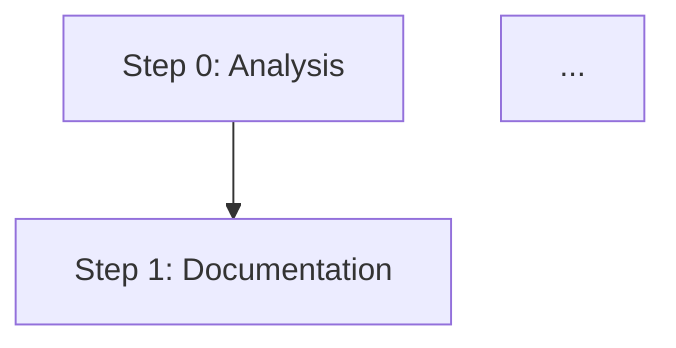

# Library API Reference

**Version**: v2.4.0  
**Last Updated**: 2025-12-23  
**Purpose**: Complete API documentation for all workflow library modules

---

## Table of Contents

- [AI Integration](#ai-integration)
  - [ai_cache.sh](#ai_cachesh)
  - [ai_helpers.sh](#ai_helperssh)
  - [ai_personas.sh](#ai_personassh)
  - [ai_prompt_builder.sh](#ai_prompt_buildersh)
  - [ai_validation.sh](#ai_validationsh)
- [Configuration](#configuration)
  - [config.sh](#configsh)
  - [config_wizard.sh](#config_wizardsh)
  - [argument_parser.sh](#argument_parsersh)
- [Workflow Orchestration](#workflow-orchestration)
  - [step_execution.sh](#step_executionsh)
  - [workflow_optimization.sh](#workflow_optimizationsh)
  - [step_adaptation.sh](#step_adaptationsh)
- [Change Intelligence](#change-intelligence)
  - [change_detection.sh](#change_detectionsh)
  - [dependency_graph.sh](#dependency_graphsh)
  - [git_cache.sh](#git_cachesh)
- [Project Analysis](#project-analysis)
  - [project_kind_detection.sh](#project_kind_detectionsh)
  - [project_kind_config.sh](#project_kind_configsh)
  - [tech_stack.sh](#tech_stacksh)
- [Metrics & Performance](#metrics--performance)
  - [metrics.sh](#metricssh)
  - [metrics_validation.sh](#metrics_validationsh)
  - [performance.sh](#performancesh)
- [File Operations](#file-operations)
  - [file_operations.sh](#file_operationssh)
  - [edit_operations.sh](#edit_operationssh)
  - [third_party_exclusion.sh](#third_party_exclusionsh)
- [Execution Management](#execution-management)
  - [backlog.sh](#backlogsh)
  - [session_manager.sh](#session_managersh)
  - [cleanup_handlers.sh](#cleanup_handlerssh)
- [Validation & Quality](#validation--quality)
  - [health_check.sh](#health_checksh)
  - [validation.sh](#validationsh)
  - [doc_template_validator.sh](#doc_template_validatorsh)
- [Utilities](#utilities)
  - [utils.sh](#utilssh)
  - [colors.sh](#colorssh)
  - [summary.sh](#summarysh)

---

## AI Integration

### ai_cache.sh

**Version**: 1.0.0 (introduced in v2.3.0)  
**Purpose**: Cache AI responses to reduce token usage and improve performance  
**Lines**: ~400

#### Configuration

```bash
AI_CACHE_DIR="${WORKFLOW_HOME}/src/workflow/.ai_cache"
AI_CACHE_INDEX="${AI_CACHE_DIR}/index.json"
AI_CACHE_TTL=86400  # 24 hours in seconds
AI_CACHE_MAX_SIZE_MB=100  # Maximum cache size in MB
```

#### Public Functions

##### `init_ai_cache()`
Initialize AI cache directory and index file.

**Usage**:
```bash
init_ai_cache
```

**Returns**: 
- `0` on success
- Skips if `USE_AI_CACHE != "true"`

**Side Effects**:
- Creates `${AI_CACHE_DIR}` directory
- Creates `${AI_CACHE_INDEX}` JSON file
- Runs cleanup of old entries

---

##### `generate_cache_key(persona, prompt)`
Generate SHA256 hash for cache key.

**Parameters**:
- `$1` - Persona name (e.g., "documentation_specialist")
- `$2` - Prompt text

**Returns**:
- Cache key (40-character SHA256 hash)

**Example**:
```bash
key=$(generate_cache_key "documentation_specialist" "Analyze this code...")
```

---

##### `check_cache(cache_key)`
Check if cached response exists and is valid.

**Parameters**:
- `$1` - Cache key

**Returns**:
- `0` if cache hit (valid and not expired)
- `1` if cache miss

**Example**:
```bash
if check_cache "$key"; then
    echo "Cache hit!"
fi
```

---

##### `get_cached_response(cache_key, output_file)`
Retrieve cached response and write to output file.

**Parameters**:
- `$1` - Cache key
- `$2` - Output file path

**Returns**:
- `0` on success
- `1` if cache miss or error

**Side Effects**:
- Writes content to `$output_file`
- Records cache hit metrics

---

##### `save_to_cache(cache_key, persona, prompt, response_file)`
Save AI response to cache.

**Parameters**:
- `$1` - Cache key
- `$2` - Persona name
- `$3` - Prompt text
- `$4` - Response file path

**Returns**:
- `0` on success
- `1` on error

**Side Effects**:
- Creates cache entry file
- Updates cache index
- Records cache miss metrics

---

##### `cleanup_ai_cache_old_entries()`
Remove expired cache entries based on TTL.

**Usage**:
```bash
cleanup_ai_cache_old_entries
```

**Returns**: `0` on success

**Side Effects**:
- Deletes expired cache files
- Updates cache index
- Updates `last_cleanup` timestamp

---

##### `get_cache_stats()`
Display cache statistics (hits, misses, size).

**Usage**:
```bash
get_cache_stats
```

**Output**:
```
AI Cache Statistics:
  Total entries: 42
  Cache size: 15.3 MB
  Hit rate: 75.5%
```

---

##### `clear_ai_cache()`
Clear entire AI cache.

**Usage**:
```bash
clear_ai_cache
```

**Returns**: `0` on success

**Side Effects**:
- Removes all cache entry files
- Resets cache index
- Preserves cache directory structure

---

##### `call_ai_with_cache(persona, prompt, output_file)`
**Main Entry Point**: Call AI with automatic caching.

**Parameters**:
- `$1` - Persona name
- `$2` - Prompt text
- `$3` - Output file path

**Returns**:
- `0` on success (cache hit or fresh call)
- `1` on error

**Behavior**:
1. Generate cache key from persona + prompt
2. Check cache for existing valid response
3. If cache hit: retrieve and return
4. If cache miss: call AI, save response, return

**Example**:
```bash
call_ai_with_cache "documentation_specialist" \
    "Analyze documentation quality" \
    "output.md"
```

---

### ai_helpers.sh

**Version**: 2.4.0  
**Purpose**: Core AI integration with GitHub Copilot CLI  
**Lines**: ~750

#### Configuration

```bash
# Copilot CLI command
COPILOT_CMD="gh copilot suggest"

# AI output limits (NEW in v2.1.0)
MAX_AI_OUTPUT_LINES=500
AI_TRUNCATION_MESSAGE="[Output truncated - exceeded ${MAX_AI_OUTPUT_LINES} lines]"
```

#### Public Functions

##### `check_copilot_available()`
Check if GitHub Copilot CLI is available.

**Usage**:
```bash
if check_copilot_available; then
    echo "Copilot available"
fi
```

**Returns**:
- `0` if available
- `1` if not available

**Checks**:
- `gh` CLI installed
- `gh copilot` extension available
- Authentication status

---

##### `ai_call(persona, prompt, output_file)`
**Main Entry Point**: Make AI call with persona and prompt.

**Parameters**:
- `$1` - Persona name
- `$2` - Prompt text
- `$3` - Output file path

**Returns**:
- `0` on success
- `1` on error

**Behavior**:
1. Validates persona exists
2. Loads persona-specific prompt template
3. Combines persona context + user prompt
4. Routes through cache if enabled (`USE_AI_CACHE=true`)
5. Writes response to output file
6. Enforces output line limits

**Example**:
```bash
ai_call "code_reviewer" \
    "Review this function for security issues" \
    "review_output.md"
```

---

##### `load_persona_prompt(persona)`
Load prompt template for specified persona.

**Parameters**:
- `$1` - Persona name

**Returns**:
- Prompt template text on stdout
- `1` on error

**Example**:
```bash
prompt=$(load_persona_prompt "test_engineer")
```

---

##### `truncate_ai_output(output_file)`
Truncate AI output to maximum line limit.

**Parameters**:
- `$1` - Output file path

**Returns**: `0` on success

**Side Effects**:
- Modifies file in-place if > `MAX_AI_OUTPUT_LINES`
- Adds truncation message

---

### ai_personas.sh

**Version**: 2.4.0  
**Purpose**: AI persona definitions and management  
**Lines**: ~300

#### Available Personas (14 total)

1. **documentation_specialist** - Documentation updates and validation
2. **consistency_analyst** - Cross-reference consistency checks
3. **code_reviewer** - Code quality and architecture review
4. **test_engineer** - Test generation and validation
5. **dependency_analyst** - Dependency graph analysis
6. **git_specialist** - Git operations and finalization
7. **performance_analyst** - Performance optimization
8. **security_analyst** - Security vulnerability scanning
9. **markdown_linter** - Markdown formatting validation
10. **context_analyst** - Contextual understanding
11. **script_validator** - Shell script validation
12. **directory_validator** - Directory structure validation
13. **test_execution_analyst** - Test execution analysis
14. **ux_designer** - UX/UI analysis (NEW in v2.4.0)

#### Public Functions

##### `list_personas()`
List all available AI personas.

**Usage**:
```bash
list_personas
```

**Output**:
```
Available AI Personas:
  1. documentation_specialist
  2. consistency_analyst
  ...
```

---

##### `validate_persona(persona_name)`
Validate that persona exists.

**Parameters**:
- `$1` - Persona name

**Returns**:
- `0` if valid
- `1` if invalid

---

### ai_prompt_builder.sh

**Version**: 2.4.0  
**Purpose**: Build context-aware prompts with project metadata  
**Lines**: ~400

#### Public Functions

##### `build_prompt(persona, base_prompt, context_data)`
Build enriched prompt with project context.

**Parameters**:
- `$1` - Persona name
- `$2` - Base prompt text
- `$3` - Context data (JSON or key-value pairs)

**Returns**:
- Complete prompt on stdout

**Context Includes**:
- Project kind
- Primary language
- Tech stack
- File patterns
- Quality standards

**Example**:
```bash
prompt=$(build_prompt "documentation_specialist" \
    "Review README.md" \
    '{"project_kind":"nodejs_api","language":"javascript"}')
```

---

##### `inject_project_context(prompt, project_kind)`
Inject project-specific context into prompt.

**Parameters**:
- `$1` - Base prompt
- `$2` - Project kind

**Returns**:
- Enriched prompt on stdout

---

### ai_validation.sh

**Version**: 2.4.0  
**Purpose**: Validate AI responses and outputs  
**Lines**: ~250

#### Public Functions

##### `validate_ai_response(response_file)`
Validate AI response quality and completeness.

**Parameters**:
- `$1` - Response file path

**Returns**:
- `0` if valid
- `1` if invalid

**Checks**:
- File exists and non-empty
- Minimum content length
- No error markers
- Valid markdown structure (if applicable)

---

##### `check_ai_errors(response_file)`
Check for AI error messages in response.

**Parameters**:
- `$1` - Response file path

**Returns**:
- `0` if no errors
- `1` if errors found

**Error Patterns**:
- "I apologize, but..."
- "Error:"
- "Failed to..."
- Rate limit messages

---

## Configuration

### config.sh

**Version**: 2.4.0  
**Purpose**: YAML configuration loading and management  
**Lines**: ~350

#### Public Functions

##### `load_config(config_file)`
Load YAML configuration file.

**Parameters**:
- `$1` - Config file path (optional, defaults to `.workflow-config.yaml`)

**Returns**:
- `0` on success
- `1` if file not found

**Side Effects**:
- Exports config variables as environment variables
- Validates required fields

**Example**:
```bash
load_config ".workflow-config.yaml"
echo "$PROJECT_KIND"  # Exported from config
```

---

##### `get_config_value(key, default_value)`
Get configuration value by key.

**Parameters**:
- `$1` - Config key (dot notation: `project.kind`)
- `$2` - Default value (optional)

**Returns**:
- Config value on stdout
- Default value if key not found

**Example**:
```bash
kind=$(get_config_value "project.kind" "generic")
```

---

##### `set_config_value(key, value)`
Set configuration value.

**Parameters**:
- `$1` - Config key
- `$2` - New value

**Returns**: `0` on success

**Side Effects**:
- Updates in-memory config
- Does NOT persist to file (use `save_config()`)

---

##### `save_config(config_file)`
Save configuration to file.

**Parameters**:
- `$1` - Config file path

**Returns**: `0` on success

**Side Effects**:
- Writes YAML to file
- Creates backup of existing file

---

### config_wizard.sh

**Version**: 2.3.1  
**Purpose**: Interactive configuration wizard  
**Lines**: ~450

#### Public Functions

##### `run_config_wizard()`
Run interactive configuration wizard.

**Usage**:
```bash
run_config_wizard
```

**Returns**: `0` on success

**Prompts For**:
- Project kind
- Primary language
- Test framework
- Test command
- Directory structure preferences

**Output**:
- Creates `.workflow-config.yaml`
- Displays configuration summary

---

### argument_parser.sh

**Version**: 2.4.0  
**Purpose**: Command-line argument parsing  
**Lines**: ~300

#### Public Functions

##### `parse_arguments(args...)`
Parse command-line arguments.

**Parameters**:
- `$@` - All command-line arguments

**Returns**: `0` on success

**Side Effects**:
- Sets global flags (`SMART_EXECUTION`, `PARALLEL`, etc.)
- Validates argument combinations

**Supported Flags**:
```bash
--smart-execution    # Enable smart step skipping
--parallel           # Enable parallel execution
--auto              # Non-interactive mode
--dry-run           # Dry run mode
--no-resume         # Disable checkpoint resume
--no-ai-cache       # Disable AI caching
--target DIR        # Target project directory
--steps STEPS       # Comma-separated step numbers
--show-graph        # Show dependency graph
--init-config       # Run configuration wizard
--show-tech-stack   # Display tech stack
--config-file FILE  # Custom config file
--help              # Show help
```

---

## Workflow Orchestration

### step_execution.sh

**Version**: 2.4.0  
**Purpose**: Step lifecycle management  
**Lines**: ~400

#### Public Functions

##### `execute_step(step_number, step_name, step_function)`
Execute workflow step with lifecycle management.

**Parameters**:
- `$1` - Step number (0-14)
- `$2` - Step name
- `$3` - Step function name

**Returns**:
- `0` on success
- `1` on failure

**Lifecycle**:
1. Pre-execution validation
2. Checkpoint creation
3. Step execution
4. Post-execution validation
5. Checkpoint update
6. Metrics recording

**Example**:
```bash
execute_step 1 "documentation" "run_documentation_step"
```

---

##### `skip_step(step_number, reason)`
Skip step with reason.

**Parameters**:
- `$1` - Step number
- `$2` - Skip reason

**Returns**: `0`

**Side Effects**:
- Records skip in metrics
- Updates checkpoint
- Logs skip reason

---

##### `validate_step_prerequisites(step_number)`
Validate step prerequisites.

**Parameters**:
- `$1` - Step number

**Returns**:
- `0` if prerequisites met
- `1` if prerequisites missing

**Checks**:
- Required files exist
- Required tools available
- Previous steps completed (if dependent)

---

### workflow_optimization.sh

**Version**: 2.3.0  
**Purpose**: Smart execution and parallel processing  
**Lines**: ~500

#### Public Functions

##### `optimize_workflow_execution()`
Determine optimal execution plan.

**Usage**:
```bash
optimize_workflow_execution
```

**Returns**: `0` on success

**Side Effects**:
- Sets `STEPS_TO_EXECUTE` array
- Sets `STEPS_TO_SKIP` array
- Creates execution plan

**Considers**:
- Change detection results
- Step dependencies
- Parallel execution groups
- User-specified steps (`--steps`)

---

##### `execute_parallel_group(group_number)`
Execute steps in parallel group.

**Parameters**:
- `$1` - Group number (1-4)

**Returns**:
- `0` if all steps succeed
- `1` if any step fails

**Parallel Groups**:
- **Group 1**: Steps 1, 3, 4, 5, 8, 13, 14
- **Group 2**: Steps 2, 6
- **Group 3**: Steps 7, 9
- **Group 4**: Steps 10, 11, 12

**Example**:
```bash
execute_parallel_group 1  # Runs steps 1,3,4,5,8,13,14 in parallel
```

---

##### `can_execute_in_parallel(step1, step2)`
Check if two steps can run in parallel.

**Parameters**:
- `$1` - First step number
- `$2` - Second step number

**Returns**:
- `0` if can run in parallel
- `1` if must run sequentially

---

### step_adaptation.sh

**Version**: 2.3.1  
**Purpose**: Adaptive step behavior based on project configuration  
**Lines**: ~300

#### Public Functions

##### `adapt_step_execution(step_number, project_kind)`
Adapt step execution to project kind.

**Parameters**:
- `$1` - Step number
- `$2` - Project kind

**Returns**:
- `0` on success
- Modified execution parameters

**Adaptations**:
- Test framework selection (Step 7)
- Directory validation patterns (Step 4)
- Documentation requirements (Step 1)
- Quality standards (Step 9)

---

## Change Intelligence

### change_detection.sh

**Version**: 2.3.0  
**Purpose**: Git diff analysis and impact classification  
**Lines**: ~600

#### Public Functions

##### `analyze_changes()`
Analyze git changes and classify impact.

**Usage**:
```bash
analyze_changes
```

**Returns**: `0` on success

**Side Effects**:
- Sets `CHANGE_TYPE` (docs_only, code_only, mixed, none)
- Sets `CHANGED_FILES` array
- Creates change report

**Output**:
```
Change Analysis:
  Type: docs_only
  Files: 3
  Impact: LOW
```

---

##### `detect_change_type(file_path)`
Detect change type for file.

**Parameters**:
- `$1` - File path

**Returns**:
- Change type on stdout: `docs`, `code`, `test`, `config`

**Patterns**:
- `.md` → `docs`
- `.sh`, `.js`, `.py` → `code`
- `test_*.sh`, `*.test.js` → `test`
- `.yaml`, `.json` → `config`

---

##### `should_execute_step(step_number, change_type)`
Determine if step should execute based on changes.

**Parameters**:
- `$1` - Step number
- `$2` - Change type

**Returns**:
- `0` if should execute
- `1` if should skip

**Smart Execution Rules**:
```
docs_only: Steps 0,1,2,3,4,11,12
code_only: Steps 0,5,6,7,8,9,10,11
test_only: Steps 0,5,6,7,11
config_only: Steps 0,4,8,11
```

---

##### `assess_change_impact()`
Assess overall impact of changes.

**Usage**:
```bash
impact=$(assess_change_impact)
```

**Returns**:
- Impact level: `LOW`, `MEDIUM`, `HIGH`, `CRITICAL`

**Factors**:
- Number of files changed
- Types of files changed
- Lines changed
- Critical files affected

---

##### `generate_change_report(output_file)`
Generate detailed change report.

**Parameters**:
- `$1` - Output file path

**Returns**: `0` on success

**Report Includes**:
- Change summary
- File-by-file analysis
- Recommended steps
- Impact assessment

---

### dependency_graph.sh

**Version**: 2.4.0  
**Purpose**: Dependency visualization and validation  
**Lines**: ~550

#### Public Functions

##### `generate_dependency_graph(format)`
Generate workflow dependency graph.

**Parameters**:
- `$1` - Output format: `mermaid`, `dot`, `text`

**Returns**:
- Graph on stdout

**Example**:
```bash
generate_dependency_graph "mermaid" > graph.mmd
```

**Mermaid Output**:


---

##### `validate_dependencies()`
Validate dependency graph consistency.

**Usage**:
```bash
if ! validate_dependencies; then
    echo "Circular dependency detected!"
fi
```

**Returns**:
- `0` if valid
- `1` if circular dependencies or conflicts

---

##### `get_step_dependencies(step_number)`
Get dependencies for step.

**Parameters**:
- `$1` - Step number

**Returns**:
- Space-separated list of prerequisite step numbers

**Example**:
```bash
deps=$(get_step_dependencies 7)
echo "$deps"  # Output: 0 5 6
```

---

##### `get_parallel_group(step_number)`
Get parallel group for step.

**Parameters**:
- `$1` - Step number

**Returns**:
- Group number (1-4) or empty if sequential

---

### git_cache.sh

**Version**: 2.3.0  
**Purpose**: Optimized git operations with caching  
**Lines**: ~150

#### Public Functions

##### `git_status_cached()`
Get cached git status.

**Usage**:
```bash
status=$(git_status_cached)
```

**Returns**:
- Git status output
- Cached for 30 seconds

---

##### `git_diff_cached(ref)`
Get cached git diff.

**Parameters**:
- `$1` - Git reference (default: `HEAD`)

**Returns**:
- Git diff output
- Cached for 60 seconds

---

##### `invalidate_git_cache()`
Clear git cache.

**Usage**:
```bash
invalidate_git_cache
```

---

## Project Analysis

### project_kind_detection.sh

**Version**: 2.3.1  
**Purpose**: Auto-detect project type  
**Lines**: ~400

#### Public Functions

##### `detect_project_kind()`
Auto-detect project kind from directory structure.

**Usage**:
```bash
kind=$(detect_project_kind)
echo "$kind"  # nodejs_api, react_spa, python_cli, etc.
```

**Returns**:
- Project kind on stdout
- `generic` if unable to detect

**Detection Logic**:
1. Check for framework markers (`package.json`, `setup.py`, etc.)
2. Analyze dependencies
3. Check directory structure
4. Examine file patterns

**Supported Kinds**:
- `shell_automation`
- `nodejs_api`
- `nodejs_cli`
- `nodejs_library`
- `static_website`
- `client_spa`
- `react_spa`
- `vue_spa`
- `python_api`
- `python_cli`
- `python_library`
- `documentation`
- `generic`

---

### project_kind_config.sh

**Version**: 2.3.1  
**Purpose**: Project kind configuration management  
**Lines**: ~350

#### Public Functions

##### `load_project_kind_config(project_kind)`
Load configuration for project kind.

**Parameters**:
- `$1` - Project kind

**Returns**: `0` on success

**Side Effects**:
- Exports project-specific variables
- Loads quality standards
- Sets testing framework

**Config Includes**:
- Documentation requirements
- Test framework
- Quality standards
- Directory structure
- File patterns

---

##### `get_quality_standards(project_kind)`
Get quality standards for project kind.

**Parameters**:
- `$1` - Project kind

**Returns**:
- JSON array of quality standards

---

### tech_stack.sh

**Version**: 2.3.1  
**Purpose**: Technology stack detection  
**Lines**: ~300

#### Public Functions

##### `detect_tech_stack()`
Detect complete technology stack.

**Usage**:
```bash
detect_tech_stack
```

**Returns**: `0` on success

**Side Effects**:
- Sets `TECH_STACK_*` variables
- Creates tech stack report

**Detects**:
- Primary language
- Framework (React, Vue, Flask, etc.)
- Build tools (Webpack, Vite, etc.)
- Test framework (Jest, pytest, BATS, etc.)
- Package manager (npm, yarn, pip, etc.)
- Runtime version

---

##### `display_tech_stack()`
Display detected technology stack.

**Usage**:
```bash
display_tech_stack
```

**Output**:
```
Technology Stack:
  Language: JavaScript (Node.js 25.2.1)
  Framework: React 18.3.1
  Build: Vite 5.0.0
  Tests: Jest 29.7.0
  Package Manager: npm 10.9.2
```

---

## Metrics & Performance

### metrics.sh

**Version**: 2.3.0  
**Purpose**: Performance tracking and analysis  
**Lines**: ~500

#### Public Functions

##### `init_metrics()`
Initialize metrics collection.

**Usage**:
```bash
init_metrics
```

**Returns**: `0` on success

**Side Effects**:
- Creates `metrics/current_run.json`
- Records workflow start time
- Initializes metric counters

---

##### `record_step_metrics(step_number, duration, status)`
Record metrics for step execution.

**Parameters**:
- `$1` - Step number
- `$2` - Duration in seconds
- `$3` - Status: `success`, `failure`, `skipped`

**Returns**: `0` on success

**Side Effects**:
- Updates current run metrics
- Appends to history

---

##### `finalize_metrics()`
Finalize and save metrics.

**Usage**:
```bash
finalize_metrics
```

**Returns**: `0` on success

**Side Effects**:
- Calculates totals
- Writes to `metrics/history.jsonl`
- Displays summary

---

##### `get_historical_metrics(step_number, metric_name)`
Get historical metrics for step.

**Parameters**:
- `$1` - Step number (optional, `all` for aggregate)
- `$2` - Metric name: `duration`, `success_rate`, `skip_rate`

**Returns**:
- Metric value on stdout

**Example**:
```bash
avg_duration=$(get_historical_metrics 7 "duration")
```

---

##### `display_metrics_summary()`
Display metrics summary.

**Usage**:
```bash
display_metrics_summary
```

**Output**:
```
Metrics Summary:
  Total Duration: 15m 30s
  Steps Executed: 10
  Steps Skipped: 5
  Success Rate: 100%
  AI Cache Hit Rate: 75%
```

---

### metrics_validation.sh

**Version**: 2.4.0  
**Purpose**: Validate metrics data integrity  
**Lines**: ~200

#### Public Functions

##### `validate_metrics_file(file_path)`
Validate metrics file structure.

**Parameters**:
- `$1` - Metrics file path

**Returns**:
- `0` if valid
- `1` if invalid

---

### performance.sh

**Version**: 2.3.0  
**Purpose**: Timing and benchmarking utilities  
**Lines**: ~200

#### Public Functions

##### `start_timer(timer_name)`
Start named timer.

**Parameters**:
- `$1` - Timer name

**Returns**: `0`

**Example**:
```bash
start_timer "step_7"
# ... do work ...
elapsed=$(stop_timer "step_7")
```

---

##### `stop_timer(timer_name)`
Stop named timer and return elapsed time.

**Parameters**:
- `$1` - Timer name

**Returns**:
- Elapsed seconds (float)

---

##### `format_duration(seconds)`
Format duration in human-readable format.

**Parameters**:
- `$1` - Duration in seconds

**Returns**:
- Formatted duration: `1h 30m 45s`

**Example**:
```bash
formatted=$(format_duration 5445)  # "1h 30m 45s"
```

---

## File Operations

### file_operations.sh

**Version**: 2.4.0  
**Purpose**: Safe file operations  
**Lines**: ~250

#### Public Functions

##### `safe_write(file_path, content)`
Write content to file with safety checks.

**Parameters**:
- `$1` - File path
- `$2` - Content

**Returns**:
- `0` on success
- `1` on error

**Safety Checks**:
- Parent directory exists
- No permission issues
- Creates backup if file exists

---

##### `safe_append(file_path, content)`
Append content to file.

**Parameters**:
- `$1` - File path
- `$2` - Content

**Returns**: `0` on success

---

##### `create_backup(file_path)`
Create backup of file.

**Parameters**:
- `$1` - File path

**Returns**:
- `0` on success
- Backup path on stdout

**Backup Format**: `file.ext.backup.TIMESTAMP`

---

### edit_operations.sh

**Version**: 2.4.0  
**Purpose**: In-place file editing utilities  
**Lines**: ~200

#### Public Functions

##### `replace_in_file(file_path, pattern, replacement)`
Replace pattern in file.

**Parameters**:
- `$1` - File path
- `$2` - Search pattern (regex)
- `$3` - Replacement text

**Returns**: `0` on success

**Example**:
```bash
replace_in_file "config.yaml" "version: .*" "version: 2.4.0"
```

---

##### `insert_after_line(file_path, search_line, content)`
Insert content after matching line.

**Parameters**:
- `$1` - File path
- `$2` - Search line pattern
- `$3` - Content to insert

**Returns**: `0` on success

---

### third_party_exclusion.sh

**Version**: 2.3.0  
**Purpose**: Exclude third-party code from analysis  
**Lines**: ~300

#### Public Functions

##### `is_third_party_file(file_path)`
Check if file is third-party code.

**Parameters**:
- `$1` - File path

**Returns**:
- `0` if third-party
- `1` if first-party

**Excluded Patterns**:
- `node_modules/`
- `vendor/`
- `venv/`, `env/`
- `dist/`, `build/`
- `.git/`
- Third-party libraries

---

##### `filter_third_party_files(file_list)`
Filter third-party files from list.

**Parameters**:
- `$1` - File list (one per line)

**Returns**:
- Filtered list on stdout

---

## Execution Management

### backlog.sh

**Version**: 2.4.0  
**Purpose**: Execution history management  
**Lines**: ~350

#### Public Functions

##### `init_backlog()`
Initialize backlog directory for run.

**Usage**:
```bash
init_backlog
```

**Returns**: `0` on success

**Side Effects**:
- Creates `backlog/workflow_TIMESTAMP/`
- Sets `BACKLOG_DIR` variable

---

##### `save_step_report(step_number, report_content)`
Save step execution report to backlog.

**Parameters**:
- `$1` - Step number
- `$2` - Report content

**Returns**: `0` on success

**Output**: `backlog/workflow_TIMESTAMP/step_N_NAME.md`

---

##### `get_last_run_dir()`
Get most recent backlog directory.

**Usage**:
```bash
last_dir=$(get_last_run_dir)
```

**Returns**:
- Path to most recent run directory

---

### session_manager.sh

**Version**: 2.4.0  
**Purpose**: Long-running process management  
**Lines**: ~250

#### Public Functions

##### `start_session(session_name, command)`
Start managed background session.

**Parameters**:
- `$1` - Session name
- `$2` - Command to run

**Returns**:
- `0` on success
- Session PID on stdout

**Example**:
```bash
pid=$(start_session "test_watcher" "npm run test:watch")
```

---

##### `stop_session(session_name)`
Stop managed session.

**Parameters**:
- `$1` - Session name

**Returns**: `0` on success

---

##### `is_session_running(session_name)`
Check if session is running.

**Parameters**:
- `$1` - Session name

**Returns**:
- `0` if running
- `1` if not running

---

### cleanup_handlers.sh

**Version**: 2.4.0  
**Purpose**: Resource cleanup and signal handling  
**Lines**: ~200

#### Public Functions

##### `register_cleanup_handler(function_name)`
Register cleanup function to run on exit.

**Parameters**:
- `$1` - Function name

**Returns**: `0`

**Example**:
```bash
cleanup_temp_files() {
    rm -rf /tmp/workflow_*
}
register_cleanup_handler cleanup_temp_files
```

---

##### `cleanup_on_exit()`
**Internal**: Run all registered cleanup handlers.

**Note**: Automatically called via `trap` on EXIT, INT, TERM

---

## Validation & Quality

### health_check.sh

**Version**: 2.4.0  
**Purpose**: System validation and prerequisites  
**Lines**: ~300

#### Public Functions

##### `run_health_check()`
Run complete health check.

**Usage**:
```bash
if ! run_health_check; then
    echo "Prerequisites not met"
    exit 1
fi
```

**Returns**:
- `0` if all checks pass
- `1` if any check fails

**Checks**:
- Bash version >= 4.0
- Git installed
- Required tools available
- Directory structure valid
- Permissions correct

---

##### `check_bash_version()`
Check Bash version compatibility.

**Returns**:
- `0` if >= 4.0
- `1` if < 4.0

---

##### `check_git_available()`
Check if Git is available and repository valid.

**Returns**:
- `0` if available
- `1` if not available

---

### validation.sh

**Version**: 2.4.0  
**Purpose**: Input validation and safety checks  
**Lines**: ~250

#### Public Functions

##### `validate_step_number(step_number)`
Validate step number is in valid range.

**Parameters**:
- `$1` - Step number

**Returns**:
- `0` if valid (0-14)
- `1` if invalid

---

##### `validate_file_path(file_path)`
Validate file path is safe.

**Parameters**:
- `$1` - File path

**Returns**:
- `0` if safe
- `1` if unsafe

**Rejects**:
- Path traversal attempts (`../`)
- Absolute paths outside project
- Special characters

---

##### `validate_project_kind(kind)`
Validate project kind is supported.

**Parameters**:
- `$1` - Project kind

**Returns**:
- `0` if valid
- `1` if invalid

---

### doc_template_validator.sh

**Version**: 2.4.0  
**Purpose**: Validate documentation templates  
**Lines**: ~200

#### Public Functions

##### `validate_doc_template(template_file)`
Validate documentation template structure.

**Parameters**:
- `$1` - Template file path

**Returns**:
- `0` if valid
- `1` if invalid

**Validates**:
- Required sections present
- Placeholder syntax correct
- Links valid
- Markdown structure

---

## Utilities

### utils.sh

**Version**: 2.4.0  
**Purpose**: Common utility functions  
**Lines**: ~150

#### Public Functions

##### `log_info(message)`
Log informational message.

**Parameters**:
- `$1` - Message

**Example**:
```bash
log_info "Starting workflow execution"
```

---

##### `log_error(message)`
Log error message.

**Parameters**:
- `$1` - Message

---

##### `log_warning(message)`
Log warning message.

**Parameters**:
- `$1` - Message

---

##### `log_success(message)`
Log success message.

**Parameters**:
- `$1` - Message

---

##### `prompt_user(message, default_value)`
Prompt user for input.

**Parameters**:
- `$1` - Prompt message
- `$2` - Default value (optional)

**Returns**:
- User input on stdout
- Default value if empty input

**Example**:
```bash
name=$(prompt_user "Enter project name" "my-project")
```

---

##### `confirm(message)`
Prompt for yes/no confirmation.

**Parameters**:
- `$1` - Confirmation message

**Returns**:
- `0` for yes
- `1` for no

**Example**:
```bash
if confirm "Continue with execution?"; then
    echo "Proceeding..."
fi
```

---

### colors.sh

**Version**: 2.4.0  
**Purpose**: Terminal color formatting  
**Lines**: ~100

#### Color Variables

```bash
COLOR_RESET='\033[0m'
COLOR_RED='\033[0;31m'
COLOR_GREEN='\033[0;32m'
COLOR_YELLOW='\033[0;33m'
COLOR_BLUE='\033[0;34m'
COLOR_MAGENTA='\033[0;35m'
COLOR_CYAN='\033[0;36m'
COLOR_BOLD='\033[1m'
```

#### Public Functions

##### `color_text(color, text)`
Apply color to text.

**Parameters**:
- `$1` - Color code
- `$2` - Text

**Returns**:
- Colored text on stdout

**Example**:
```bash
echo "$(color_text "$COLOR_GREEN" "Success!")"
```

---

### summary.sh

**Version**: 2.4.0  
**Purpose**: Report generation  
**Lines**: ~150

#### Public Functions

##### `generate_summary()`
Generate workflow execution summary.

**Usage**:
```bash
generate_summary > summary.md
```

**Returns**:
- Markdown summary on stdout

**Includes**:
- Execution statistics
- Step results
- Metrics summary
- Recommendations

---

##### `generate_step_summary(step_number)`
Generate summary for specific step.

**Parameters**:
- `$1` - Step number

**Returns**:
- Step summary on stdout

---

## Usage Examples

### Basic Workflow Execution

```bash
#!/bin/bash
source src/workflow/lib/ai_helpers.sh
source src/workflow/lib/step_execution.sh
source src/workflow/lib/metrics.sh

# Initialize
init_metrics
init_backlog

# Execute steps
execute_step 0 "analysis" "run_analysis_step"
execute_step 1 "documentation" "run_documentation_step"

# Finalize
finalize_metrics
generate_summary
```

### Custom AI Integration

```bash
#!/bin/bash
source src/workflow/lib/ai_helpers.sh
source src/workflow/lib/ai_cache.sh

# Initialize AI caching
init_ai_cache

# Make AI call with caching
ai_call "code_reviewer" \
    "Review this function for performance issues: $(cat function.js)" \
    "review_output.md"

# Display cache stats
get_cache_stats
```

### Change Detection and Smart Execution

```bash
#!/bin/bash
source src/workflow/lib/change_detection.sh
source src/workflow/lib/workflow_optimization.sh

# Analyze changes
analyze_changes

# Get optimal execution plan
optimize_workflow_execution

# Execute only necessary steps
for step in "${STEPS_TO_EXECUTE[@]}"; do
    execute_step "$step" "..." "..."
done
```

### Project Configuration

```bash
#!/bin/bash
source src/workflow/lib/config.sh
source src/workflow/lib/project_kind_detection.sh

# Auto-detect or load config
if [[ -f .workflow-config.yaml ]]; then
    load_config .workflow-config.yaml
else
    PROJECT_KIND=$(detect_project_kind)
    load_project_kind_config "$PROJECT_KIND"
fi

# Use configuration
echo "Project: $PROJECT_KIND"
echo "Language: $PRIMARY_LANGUAGE"
```

---

## Contributing

When adding new library modules:

1. Follow naming convention: `module_name.sh`
2. Include header comment with version and purpose
3. Document all public functions
4. Write unit tests
5. Update this API reference
6. Update module inventory in `src/workflow/README.md`

---

**Last Updated**: 2025-12-23  
**Version**: 2.4.0  
**Maintained By**: AI Workflow Automation Project
