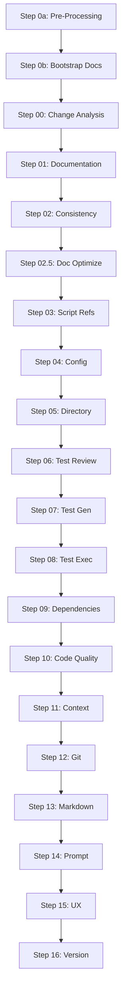

# Step Modules API Reference

**Version**: v3.1.0  
**Last Updated**: 2026-02-08

> 📖 **Reference**: See [docs/PROJECT_REFERENCE.md](../../PROJECT_REFERENCE.md) for module inventory and version history.

## Overview

The AI Workflow Automation system implements **18 step modules** (step 0a through step 16) that form the core execution pipeline. Each step module is responsible for a specific phase of the workflow validation and enhancement process.

## Table of Contents

- [Step Execution Model](#step-execution-model)
- [Standard Step Interface](#standard-step-interface)
- [Step Modules Reference](#step-modules-reference)
  - [Step 0a: Pre-Processing](#step-0a-pre-processing)
  - [Step 0b: Bootstrap Documentation](#step-0b-bootstrap-documentation)
  - [Step 00: Change Analysis](#step-00-change-analysis)
  - [Step 01: Documentation Analysis](#step-01-documentation-analysis)
  - [Step 02: Consistency Check](#step-02-consistency-check)
  - [Step 02.5: Documentation Optimization](#step-025-documentation-optimization)
  - [Step 03: Script References](#step-03-script-references)
  - [Step 04: Config Validation](#step-04-config-validation)
  - [Step 05: Directory Structure](#step-05-directory-structure)
  - [Step 06: Test Review](#step-06-test-review)
  - [Step 07: Test Generation](#step-07-test-generation)
  - [Step 08: Test Execution](#step-08-test-execution)
  - [Step 09: Dependencies](#step-09-dependencies)
  - [Step 10: Code Quality](#step-10-code-quality)
  - [Step 11: Context Management](#step-11-context-management)
  - [Step 12: Git Automation](#step-12-git-automation)
  - [Step 13: Markdown Lint](#step-13-markdown-lint)
  - [Step 14: Prompt Engineer](#step-14-prompt-engineer)
  - [Step 15: UX Analysis](#step-15-ux-analysis)
  - [Step 16: Version Update](#step-16-version-update)

---

## Step Execution Model

All step modules follow a consistent execution pattern:

```bash
# Step lifecycle
1. Validation: validate_step_XX()
2. Execution: execute_step_XX()
3. Result: Generate step report (markdown)
4. Metrics: Track duration and status
```

### Execution Flow

```
orchestrator (execute_tests_docs_workflow.sh)
    ↓
step module (step_XX_name.sh)
    ↓
validate_step_XX() → Pre-flight checks
    ↓
execute_step_XX() → Main execution
    ↓
generate report → Save to backlog/
    ↓
update metrics → Track timing/status
```

---

## Standard Step Interface

Every step module must implement these functions:

### `validate_step_XX()`

**Purpose**: Pre-flight validation before step execution

**Parameters**: None

**Returns**: 
- `0` - Validation passed, proceed with execution
- `1` - Validation failed, skip step

**Common Validations**:
- Required files exist
- Environment variables set
- Dependencies available
- Prerequisites completed

**Example**:
```bash
validate_step_01() {
    local step_num="01"
    
    # Check if documentation exists
    if [[ ! -d "${TARGET_DIR}/docs" ]]; then
        log_warning "Step ${step_num}: No docs directory found"
        return 1
    fi
    
    # Check for Copilot CLI
    if ! check_copilot_available; then
        log_error "Step ${step_num}: GitHub Copilot CLI not available"
        return 1
    fi
    
    return 0
}
```

### `execute_step_XX()`

**Purpose**: Main step execution logic

**Parameters**: None (uses global variables)

**Returns**:
- `0` - Step completed successfully
- `1` - Step failed with errors

**Common Patterns**:
- Source required library modules
- Initialize step-specific variables
- Call AI helpers or processing functions
- Generate output files
- Save step report

**Example**:
```bash
execute_step_01() {
    local step_num="01"
    local step_name="Documentation Analysis"
    
    log_info "Starting Step ${step_num}: ${step_name}"
    
    # Main execution logic
    # ... process files, call AI, generate output
    
    # Save report
    local report_file="${BACKLOG_DIR}/step${step_num}_${step_name// /_}.md"
    save_step_report "${step_num}" "${step_name}" "${report_file}"
    
    return 0
}
```

---

## Step Modules Reference

### Step 0a: Pre-Processing

**File**: `version_update.sh`  
**Purpose**: Version management and pre-workflow initialization  
**AI Persona**: None (automated)  
**Dependencies**: `utils.sh`, `git_automation.sh`

#### Functions

##### `validate_step_0a()`
Pre-flight check for version update prerequisites.

**Returns**: 
- `0` - Ready to update version
- `1` - Skip version update

##### `execute_step_0a()`
Updates project version and prepares workflow execution.

**Process**:
1. Parse current version from CHANGELOG.md or package.json
2. Increment version based on change scope
3. Update version files
4. Create git tag (if auto-commit enabled)

**Returns**: `0` on success, `1` on failure

---

### Step 0b: Bootstrap Documentation

**File**: `bootstrap_docs.sh`  
**Purpose**: Generate comprehensive documentation from scratch for undocumented codebases  
**AI Persona**: `technical_writer` (NEW v3.1.0)  
**Dependencies**: `ai_helpers.sh`, `file_operations.sh`, `tech_stack.sh`

#### Functions

##### `validate_step_0b()`
Check if documentation bootstrapping is needed.

**Returns**: 
- `0` - Documentation incomplete or missing, proceed with bootstrap
- `1` - Documentation complete, skip bootstrap

##### `execute_step_0b()`
Generate comprehensive documentation using AI technical writer persona.

**Process**:
1. Analyze codebase structure and tech stack
2. Generate API documentation from source code
3. Create architecture guides from project structure
4. Write user guides based on detected functionality
5. Build developer documentation with contribution guidelines

**Generated Documents**:
- `docs/reference/api/API_REFERENCE.md` - Complete API documentation
- `docs/architecture/ARCHITECTURE.md` - System architecture guide
- `docs/guides/user/USER_GUIDE.md` - End-user documentation
- `docs/guides/developer/DEVELOPER_GUIDE.md` - Developer onboarding
- `docs/CONFIGURATION.md` - Configuration reference

**Returns**: `0` on success, `1` on failure

---

### Step 00: Change Analysis

**File**: `step_00_analyze.sh`  
**Purpose**: Analyze git changes to optimize workflow execution  
**AI Persona**: None (automated)  
**Dependencies**: `change_detection.sh`, `git_automation.sh`

#### Functions

##### `validate_step_00()`
Ensure git repository is accessible and has changes.

**Returns**: 
- `0` - Git repository valid
- `1` - Not a git repository or no changes

##### `execute_step_00()`
Analyze changes and determine execution strategy.

**Process**:
1. Detect change types (docs-only, test-only, code changes)
2. Assess change impact (Low/Medium/High)
3. Generate recommended step list
4. Save change analysis report

**Output**: `CHANGE_IMPACT_ANALYSIS.md`

**Returns**: `0` on success, `1` on failure

---

### Step 01: Documentation Analysis

**File**: `step_01_documentation.sh`  
**Purpose**: AI-powered documentation analysis and issue detection  
**AI Persona**: `documentation_specialist`  
**Dependencies**: `ai_helpers.sh`, `ai_prompt_builder.sh`, `third_party_exclusion.sh`

#### Functions

##### `validate_step_01()`
Check if documentation exists and AI is available.

**Returns**: 
- `0` - Ready for documentation analysis
- `1` - Skip analysis (no docs or AI unavailable)

##### `execute_step_01()`
Analyze documentation quality and generate improvement recommendations.

**Process**:
1. Discover all documentation files (exclude third-party)
2. Build project-aware AI prompt
3. Call documentation_specialist persona
4. Extract issues and recommendations
5. Generate structured analysis report

**Optimizations** (NEW v3.2.0):
- **Incremental processing**: Skip unchanged docs (96% savings)
- **Parallel analysis**: Concurrent AI processing (71% savings)
- **Average time**: 14.5 min → 3 min (79% faster)

**Output**: `step01_documentation_analysis.md`

**Returns**: `0` on success, `1` on failure

---

### Step 02: Consistency Check

**File**: `step_02_consistency.sh`  
**Purpose**: Cross-reference validation between documentation and code  
**AI Persona**: `documentation_specialist`  
**Dependencies**: `ai_helpers.sh`, `consistency_checker.sh`

#### Functions

##### `validate_step_02()`
Ensure both documentation and code are available.

**Returns**: 
- `0` - Ready for consistency check
- `1` - Missing documentation or code

##### `execute_step_02()`
Validate documentation accuracy against codebase.

**Process**:
1. Build cross-reference map (docs ↔ code)
2. Check for outdated references
3. Validate API examples
4. Identify missing documentation
5. Generate consistency report

**Output**: `step02_consistency_check.md`

**Returns**: `0` on success, `1` on failure

---

### Step 02.5: Documentation Optimization

**File**: `step_02_5_doc_optimize.sh`  
**Purpose**: Optimize documentation structure and content  
**AI Persona**: `documentation_specialist`  
**Dependencies**: `ai_helpers.sh`, `doc_template_validator.sh`

#### Functions

##### `validate_step_02_5()`
Check if documentation optimization is needed.

**Returns**: 
- `0` - Optimization can proceed
- `1` - Skip optimization

##### `execute_step_02_5()`
Apply AI-driven documentation improvements.

**Process**:
1. Analyze documentation structure
2. Identify redundancy and gaps
3. Suggest reorganization
4. Apply template standards
5. Generate optimization report

**Output**: `step02_5_doc_optimization.md`

**Returns**: `0` on success, `1` on failure

---

### Step 03: Script References

**File**: `step_03_script_refs.sh`  
**Purpose**: Validate script references and dependencies  
**AI Persona**: None (automated)  
**Dependencies**: `script_analyzer.sh`, `dependency_graph.sh`

#### Functions

##### `validate_step_03()`
Check if scripts exist for analysis.

**Returns**: 
- `0` - Scripts found
- `1` - No scripts to analyze

##### `execute_step_03()`
Analyze script interdependencies and validate references.

**Process**:
1. Parse all script files
2. Extract `source` statements
3. Build dependency graph
4. Validate all references
5. Report broken links

**Output**: `step03_script_references.md`

**Returns**: `0` on success, `1` on failure

---

### Step 04: Config Validation

**File**: `step_04_config_validation.sh`  
**Purpose**: Validate configuration files (YAML, JSON, .env)  
**AI Persona**: None (automated)  
**Dependencies**: `config_validator.sh`, `jq_wrapper.sh`, `yaml_parser.sh`

#### Functions

##### `validate_step_04()`
Check if configuration files exist.

**Returns**: 
- `0` - Config files found
- `1` - No config to validate

##### `execute_step_04()`
Validate configuration syntax and schema.

**Process**:
1. Discover config files
2. Validate YAML/JSON syntax
3. Check schema compliance
4. Validate environment variables
5. Report validation errors

**Output**: `step04_config_validation.md`

**Returns**: `0` on success, `1` on failure

---

### Step 05: Directory Structure

**File**: `step_05_directory.sh`  
**Purpose**: Validate and optimize directory organization  
**AI Persona**: `documentation_specialist`  
**Dependencies**: `ai_helpers.sh`, `file_operations.sh`

#### Functions

##### `validate_step_05()`
Check if directory structure can be analyzed.

**Returns**: 
- `0` - Directory accessible
- `1` - Cannot access directory

##### `execute_step_05()`
Analyze directory structure and suggest improvements.

**Process**:
1. Generate directory tree
2. Analyze organization patterns
3. Check for best practices
4. Suggest reorganization
5. Generate structure report

**Output**: `step05_directory_structure.md`

**Returns**: `0` on success, `1` on failure

---

### Step 06: Test Review

**File**: `step_06_test_review.sh`  
**Purpose**: Review existing test coverage and quality  
**AI Persona**: `test_engineer`  
**Dependencies**: `ai_helpers.sh`, `test_analyzer.sh`

#### Functions

##### `validate_step_06()`
Check if tests exist for review.

**Returns**: 
- `0` - Tests found
- `1` - No tests to review

##### `execute_step_06()`
Analyze test quality and coverage.

**Process**:
1. Discover test files
2. Analyze test coverage
3. Review test patterns
4. Identify gaps
5. Generate review report

**Output**: `step06_test_review.md`

**Returns**: `0` on success, `1` on failure

---

### Step 07: Test Generation

**File**: `step_07_test_gen.sh`  
**Purpose**: Generate missing tests with AI assistance  
**AI Persona**: `test_engineer`  
**Dependencies**: `ai_helpers.sh`, `test_generator.sh`

#### Functions

##### `validate_step_07()`
Check if test generation is needed.

**Returns**: 
- `0` - Tests needed
- `1` - Complete coverage

##### `execute_step_07()`
Generate tests for untested code.

**Process**:
1. Identify untested modules
2. Build test generation prompt
3. Call test_engineer persona
4. Generate test files
5. Validate syntax

**Output**: `step07_test_generation.md` + generated test files

**Returns**: `0` on success, `1` on failure

---

### Step 08: Test Execution

**File**: `step_08_test_exec.sh`  
**Purpose**: Run test suites and report results  
**AI Persona**: None (automated)  
**Dependencies**: `session_manager.sh`, `test_executor.sh`

#### Functions

##### `validate_step_08()`
Check if test framework is configured.

**Returns**: 
- `0` - Tests can run
- `1` - No test framework

##### `execute_step_08()`
Execute test suites and capture results.

**Process**:
1. Detect test framework (Jest, pytest, etc.)
2. Run test commands
3. Parse test output
4. Generate coverage report
5. Report failures

**Output**: `step08_test_execution.md`

**Returns**: `0` on success, `1` on failure (tests may still fail)

---

### Step 09: Dependencies

**File**: `step_09_dependencies.sh`  
**Purpose**: Analyze and validate dependencies  
**AI Persona**: None (automated)  
**Dependencies**: `dependency_analyzer.sh`, `security_scanner.sh`

#### Functions

##### `validate_step_09()`
Check if dependency files exist.

**Returns**: 
- `0` - Dependencies configured
- `1` - No dependencies

##### `execute_step_09()`
Analyze dependencies for issues.

**Process**:
1. Parse dependency files (package.json, requirements.txt)
2. Check for outdated packages
3. Scan for security vulnerabilities
4. Validate version constraints
5. Report issues

**Output**: `step09_dependencies.md`

**Returns**: `0` on success, `1` on failure

---

### Step 10: Code Quality

**File**: `step_10_code_quality.sh`  
**Purpose**: AI-powered code quality assessment  
**AI Persona**: `code_reviewer`  
**Dependencies**: `ai_helpers.sh`, `linter_runner.sh`

#### Functions

##### `validate_step_10()`
Check if code quality tools are available.

**Returns**: 
- `0` - Can assess quality
- `1` - No quality tools

##### `execute_step_10()`
Comprehensive code quality analysis.

**Process**:
1. Run linters (ESLint, shellcheck, etc.)
2. Analyze code complexity
3. Check style compliance
4. AI code review
5. Generate quality report

**Output**: `step10_code_quality.md`

**Returns**: `0` on success, `1` on failure

---

### Step 11: Context Management

**File**: `step_11_context.sh`  
**Purpose**: Manage workflow context and state  
**AI Persona**: None (automated)  
**Dependencies**: `context_manager.sh`, `checkpoint_handler.sh`

#### Functions

##### `validate_step_11()`
Check if context files exist.

**Returns**: 
- `0` - Context available
- `1` - No context

##### `execute_step_11()`
Update and persist workflow context.

**Process**:
1. Collect workflow state
2. Update context files
3. Save checkpoints
4. Clean old context
5. Report context status

**Output**: `step11_context_management.md`

**Returns**: `0` on success, `1` on failure

---

### Step 12: Git Automation

**File**: `step_12_git.sh`  
**Purpose**: Git operations and repository cleanup  
**AI Persona**: None (automated)  
**Dependencies**: `git_automation.sh`, `commit_generator.sh`

#### Functions

##### `validate_step_12()`
Check if git repository is initialized.

**Returns**: 
- `0` - Git available
- `1` - Not a git repo

##### `execute_step_12()`
Perform git operations (commit, tag, cleanup).

**Process**:
1. Stage workflow artifacts
2. Generate commit message
3. Create commit (if --auto-commit)
4. Create version tags
5. Report git status

**Output**: `step12_git_automation.md`

**Returns**: `0` on success, `1` on failure

---

### Step 13: Markdown Lint

**File**: `step_13_markdown_lint.sh`  
**Purpose**: Validate markdown syntax and style  
**AI Persona**: None (automated)  
**Dependencies**: `markdown_linter.sh`, `link_checker.sh`

#### Functions

##### `validate_step_13()`
Check if markdown files exist.

**Returns**: 
- `0` - Markdown found
- `1` - No markdown

##### `execute_step_13()`
Lint markdown files and check links.

**Process**:
1. Discover markdown files
2. Run markdownlint
3. Check internal links
4. Validate external links
5. Report lint errors

**Output**: `step13_markdown_lint.md`

**Returns**: `0` on success, `1` on failure

---

### Step 14: Prompt Engineer

**File**: `step_14_prompt_engineer.sh`  
**Purpose**: Optimize AI prompts for better results  
**AI Persona**: `prompt_engineer`  
**Dependencies**: `ai_helpers.sh`, `prompt_analyzer.sh`

#### Functions

##### `validate_step_14()`
Check if prompts exist for optimization.

**Returns**: 
- `0` - Prompts found
- `1` - No prompts

##### `execute_step_14()`
Analyze and improve AI prompts.

**Process**:
1. Parse prompt templates
2. Analyze effectiveness
3. Suggest improvements
4. Test optimized prompts
5. Report recommendations

**Output**: `step14_prompt_engineering.md`

**Returns**: `0` on success, `1` on failure

---

### Step 15: UX Analysis

**File**: `step_15_ux_analysis.sh`  
**Purpose**: UI/UX analysis with accessibility checking  
**AI Persona**: `ux_designer` (NEW v2.4.0)  
**Dependencies**: `ai_helpers.sh`, `accessibility_checker.sh`

#### Functions

##### `validate_step_15()`
Check if UI/UX analysis applies to project.

**Returns**: 
- `0` - UI/UX analysis needed (client_spa, react_spa, static_website)
- `1` - Skip UX analysis (non-UI projects)

##### `execute_step_15()`
Comprehensive UX and accessibility analysis.

**Process**:
1. Detect UI framework
2. Analyze component structure
3. Check WCAG 2.1 compliance
4. Review design patterns
5. Generate UX report

**WCAG 2.1 Checks**:
- Perceivable: Alt text, color contrast, captions
- Operable: Keyboard navigation, focus management
- Understandable: Language, error identification
- Robust: Valid HTML, ARIA attributes

**Output**: `step15_ux_analysis.md`

**Returns**: `0` on success, `1` on failure

---

### Step 16: Version Update

**File**: `step_16_version_update.sh`  
**Purpose**: Final version update and CHANGELOG generation  
**AI Persona**: None (automated)  
**Dependencies**: `version_manager.sh`, `changelog_generator.sh`

#### Functions

##### `validate_step_16()`
Check if version update is needed.

**Returns**: 
- `0` - Version update needed
- `1` - Skip version update

##### `execute_step_16()`
Update version and generate CHANGELOG.

**Process**:
1. Parse commit messages
2. Determine version bump (major/minor/patch)
3. Update version files
4. Generate CHANGELOG entry
5. Create git tag

**Output**: `step16_version_update.md` + updated CHANGELOG.md

**Returns**: `0` on success, `1` on failure

---

## Step Dependencies

Steps have dependencies that determine execution order:



---

## Integration Examples

### Custom Step Execution

```bash
#!/usr/bin/env bash
# Execute specific steps

source "src/workflow/steps/step_01_documentation.sh"
source "src/workflow/lib/metrics.sh"

# Initialize
init_metrics

# Execute step 01
if validate_step_01; then
    start_step_timer "01" "Documentation Analysis"
    
    if execute_step_01; then
        stop_step_timer "01" "success"
        echo "Step 01 completed successfully"
    else
        stop_step_timer "01" "failure"
        echo "Step 01 failed"
    fi
else
    echo "Step 01 validation failed, skipping"
fi
```

### Parallel Step Execution

```bash
#!/usr/bin/env bash
# Execute independent steps in parallel

source "src/workflow/lib/workflow_optimization.sh"

# Define parallel tracks
PARALLEL_TRACKS=(
    "03,04,05"  # Track 1: Script refs, config, directory
    "13,14"     # Track 2: Markdown lint, prompt engineer
)

# Execute
execute_parallel_tracks "${PARALLEL_TRACKS[@]}"
```

---

## Best Practices

### Step Development

1. **Always implement both functions**: `validate_step_XX()` and `execute_step_XX()`
2. **Use consistent naming**: `step_XX_descriptive_name.sh`
3. **Source required libraries**: Only source what's needed
4. **Generate reports**: Always create step report in backlog/
5. **Return proper exit codes**: 0=success, 1=failure

### Error Handling

```bash
execute_step_XX() {
    local step_num="XX"
    
    # Set error handling
    set -euo pipefail
    trap 'handle_step_error "${step_num}" "$?"' ERR
    
    # Main logic
    # ...
    
    return 0
}
```

### Logging

```bash
# Use consistent logging
log_info "Step XX: Starting process..."
log_warning "Step XX: Non-critical issue detected"
log_error "Step XX: Critical failure"
```

---

## See Also

- [Library Modules API Reference](../api/README.md)
- [Workflow Optimization Guide](../../STEP1_OPTIMIZATION_GUIDE.md)
- [Multi-Stage Pipeline Guide](../../MULTI_STAGE_PIPELINE_GUIDE.md)
- [Project Reference](../../PROJECT_REFERENCE.md)
