# Workflow Automation Visual Diagrams

**Version**: 2.4.0  
**Created**: 2025-12-23  
**Purpose**: Visual documentation for complex workflow concepts

This document provides visual diagrams using Mermaid to explain the complex workflows, dependencies, and execution patterns in the AI Workflow Automation system.

---

## Table of Contents

1. [15-Step Workflow Flow](#15-step-workflow-flow)
2. [Dependency Relationships](#dependency-relationships)
3. [Parallel Execution Groups](#parallel-execution-groups)
4. [Change Detection Logic](#change-detection-logic)
5. [Smart Execution Decision Tree](#smart-execution-decision-tree)
6. [AI Cache Flow](#ai-cache-flow)
7. [Checkpoint Resume Logic](#checkpoint-resume-logic)
8. [Module Architecture](#module-architecture)

---

## 15-Step Workflow Flow

### Sequential Execution (Baseline)

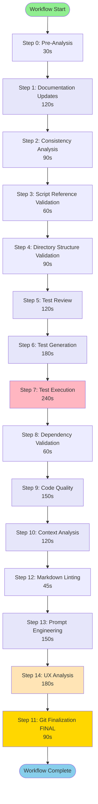

**Total Sequential Time**: ~1,545 seconds (~26 minutes)

---

## Dependency Relationships

### Complete Dependency Graph

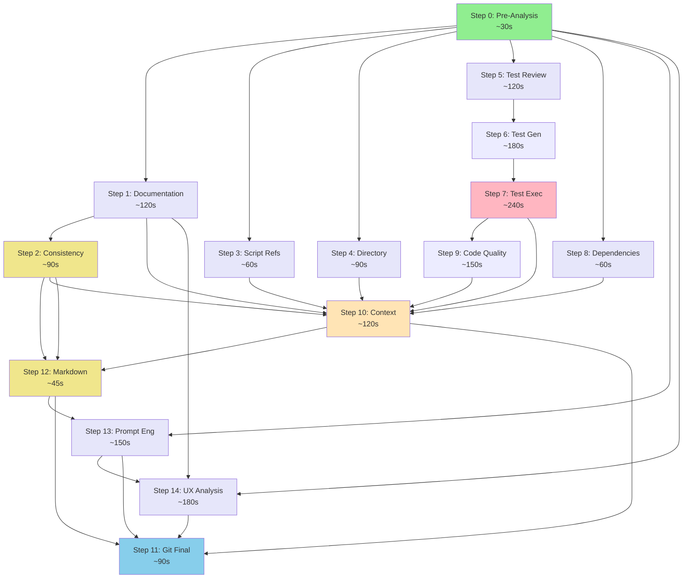

### Critical Path (Longest Sequential Chain)

**Critical Path Duration**: ~1,155 seconds (~19 minutes)

---

## Parallel Execution Groups

### 3-Track Parallel Execution

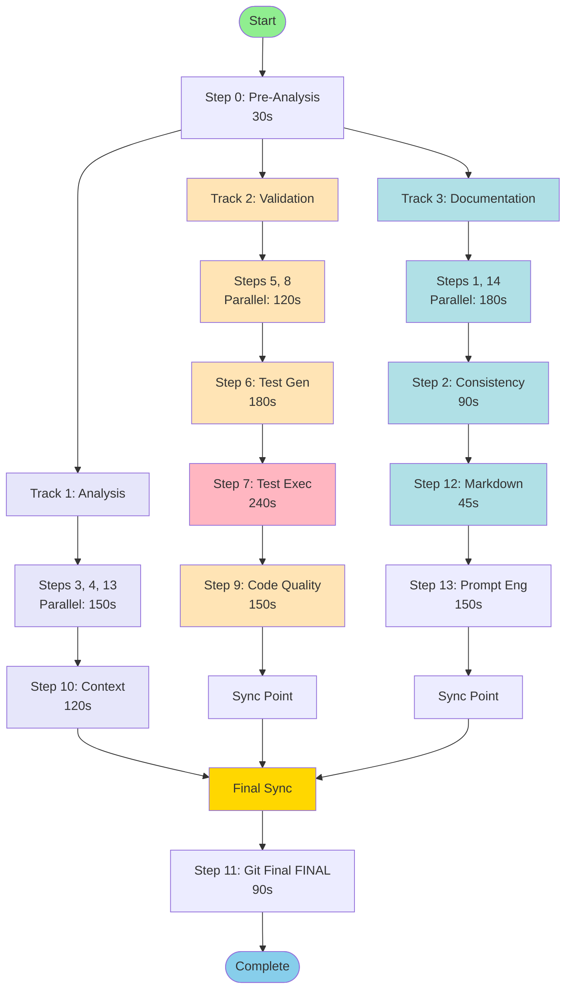

### Parallel Group Details

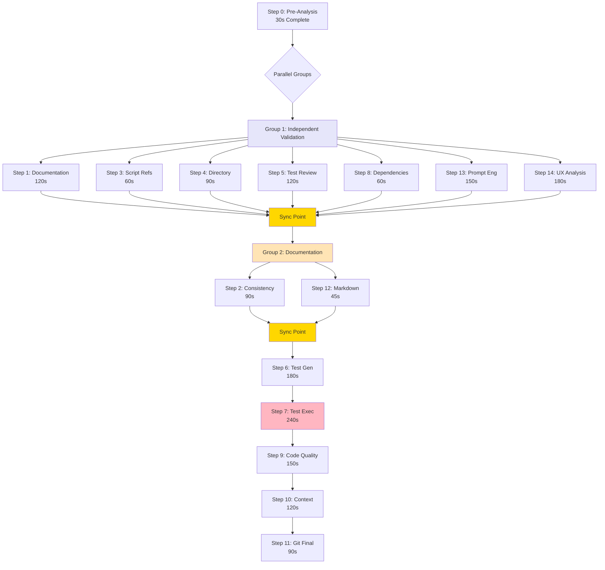

**Parallel Execution Time**: ~930 seconds (~15.5 minutes)  
**Time Savings**: ~465 seconds (~8 minutes, **33% faster**)

---

## Change Detection Logic

### Impact Classification Flow

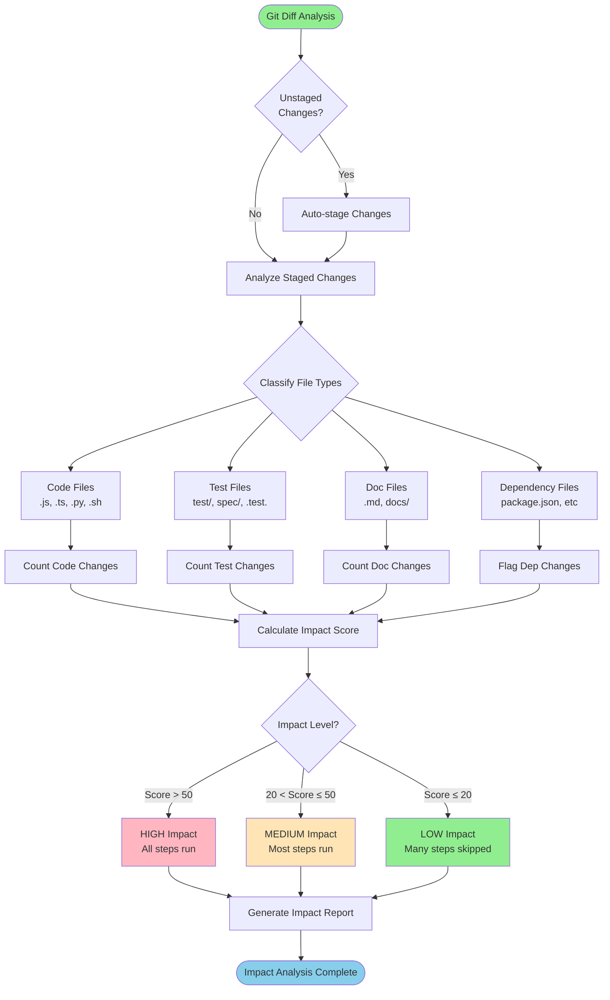

### Impact Score Calculation

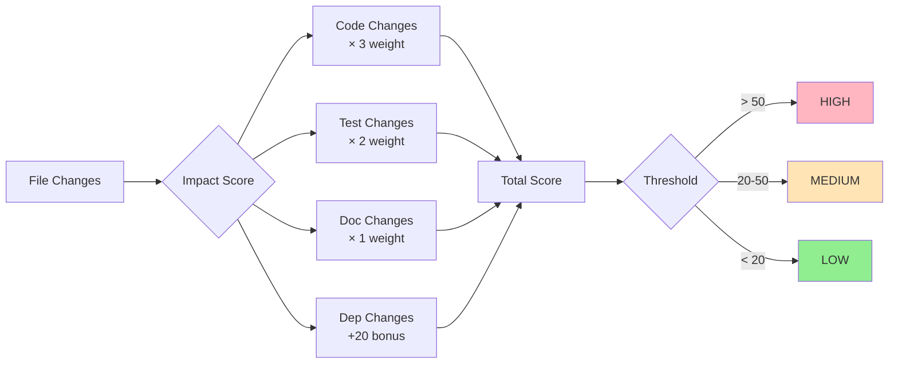

---

## Smart Execution Decision Tree

### Step Skip Logic

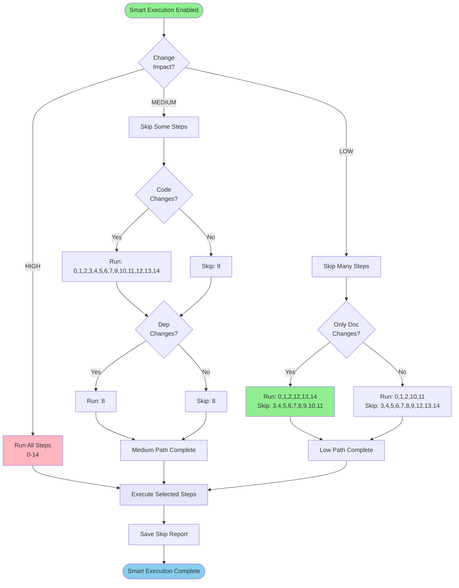

### Skip Rules by Change Type

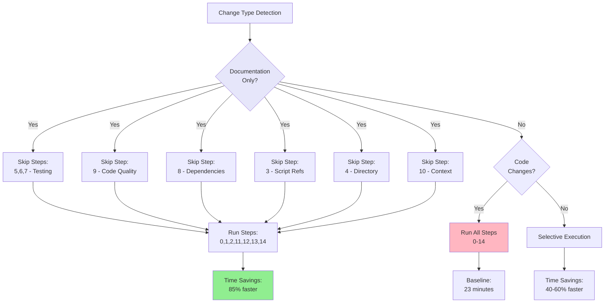

---

## AI Cache Flow

### Cache Lookup and Storage

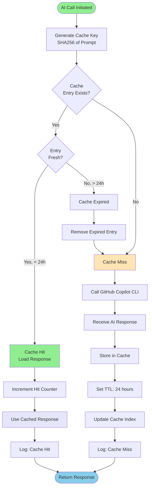

### Cache Maintenance

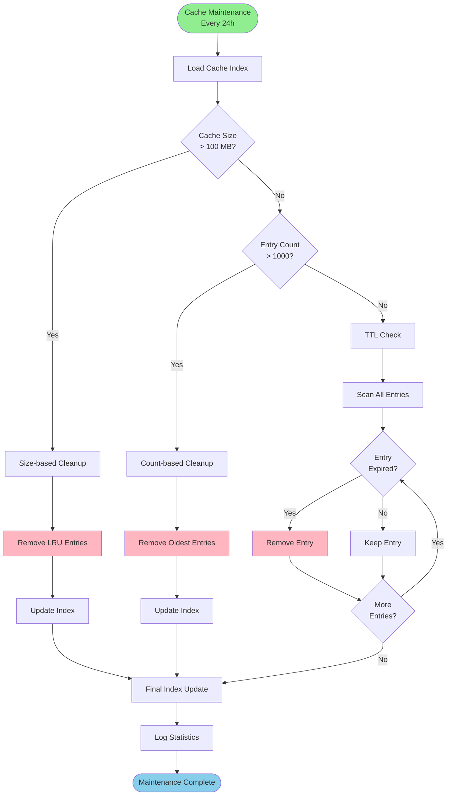

**Cache Benefits**:
- 60-80% token usage reduction
- Faster execution for repeated operations
- Automatic TTL management (24 hours)
- Automatic cleanup and maintenance

---

## Checkpoint Resume Logic

### Checkpoint Creation and Resume

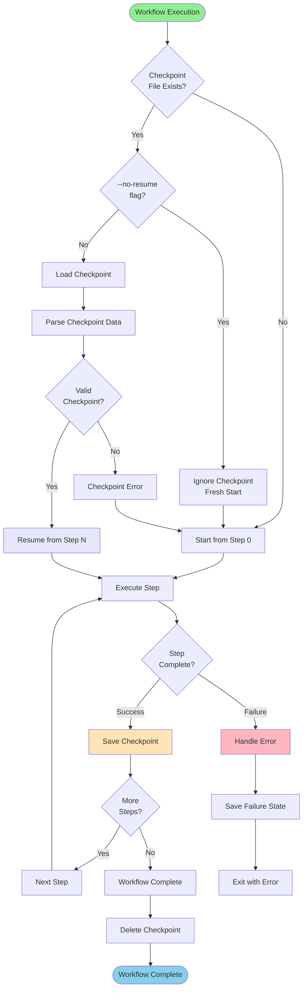

### Checkpoint File Structure

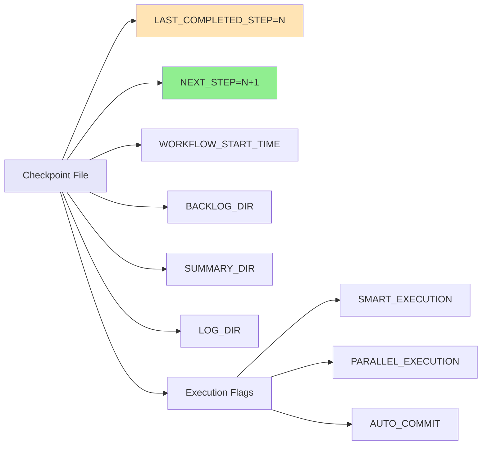

---

## Module Architecture

### Core Module Relationships

```mermaid
graph TD
    Main[execute_tests_docs_workflow.sh] --> Orchestration[Orchestration Layer]
    Main --> Library[Library Layer]
    
    Orchestration --> PreFlight[pre_flight.sh]
    Orchestration --> Validation[validation_orchestrator.sh]
    Orchestration --> Quality[quality_orchestrator.sh]
    Orchestration --> Finalization[finalization_orchestrator.sh]
    
    Library --> AI[AI Integration]
    Library --> Change[Change Management]
    Library --> Metrics[Metrics & Performance]
    Library --> Config[Configuration]
    Library --> Utils[Utilities]
    
    AI --> AIHelpers[ai_helpers.sh]
    AI --> AICache[ai_cache.sh]
    AI --> AIPersonas[ai_personas.sh]
    AI --> AIPrompt[ai_prompt_builder.sh]
    AI --> AIValidation[ai_validation.sh]
    
    Change --> ChangeDetect[change_detection.sh]
    Change --> GitCache[git_cache.sh]
    Change --> DependencyGraph[dependency_graph.sh]
    
    Metrics --> MetricsCore[metrics.sh]
    Metrics --> MetricsValidation[metrics_validation.sh]
    Metrics --> Performance[performance.sh]
    
    Config --> ConfigCore[config.sh]
    Config --> ConfigWizard[config_wizard.sh]
    Config --> TechStack[tech_stack.sh]
    Config --> ProjectKind[project_kind_config.sh]
    
    Utils --> FileOps[file_operations.sh]
    Utils --> EditOps[edit_operations.sh]
    Utils --> UtilsCore[utils.sh]
    Utils --> Colors[colors.sh]
    
    style Main fill:#90EE90
    style Orchestration fill:#E6E6FA
    style Library fill:#FFE4B5
    style AI fill:#B0E0E6
    style Change fill:#FFB6C1
    style Metrics fill:#F0E68C
    style Config fill:#DDA0DD
    style Utils fill:#F5DEB3
```

### Step Execution Flow

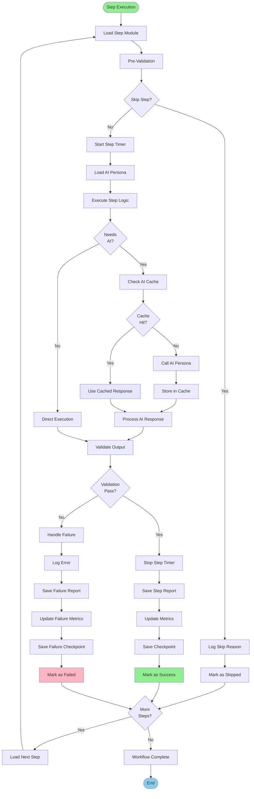

### AI Persona Assignment

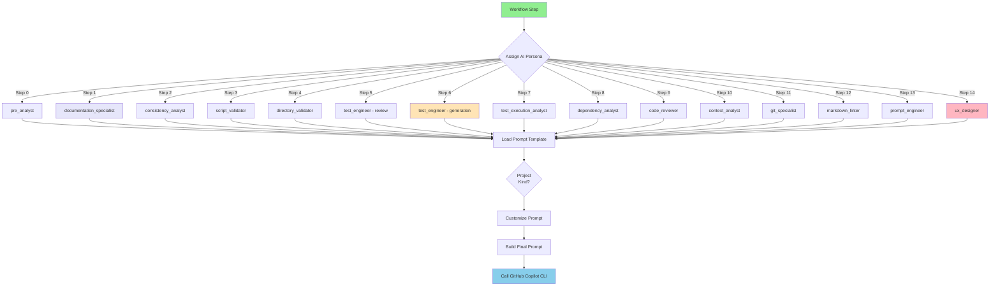

---

## Performance Comparison

### Execution Time by Mode

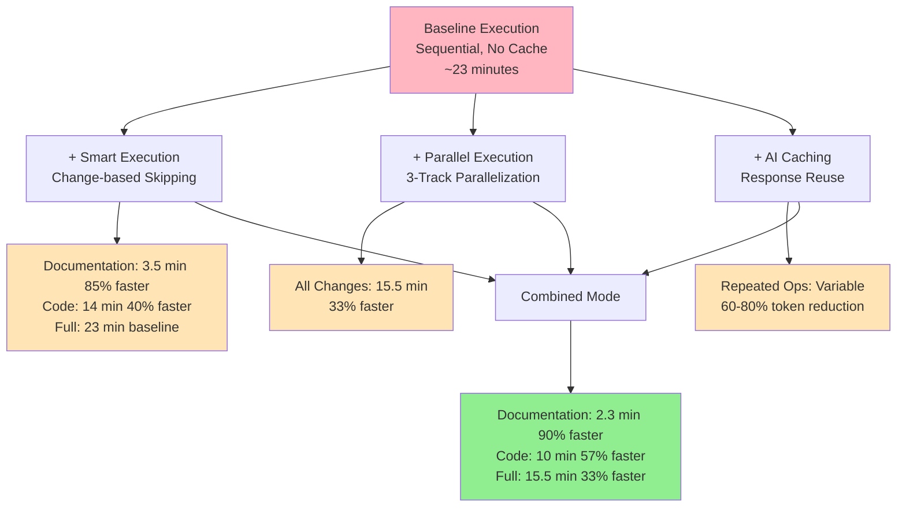

---

## Technology Stack Detection

### Detection Flow

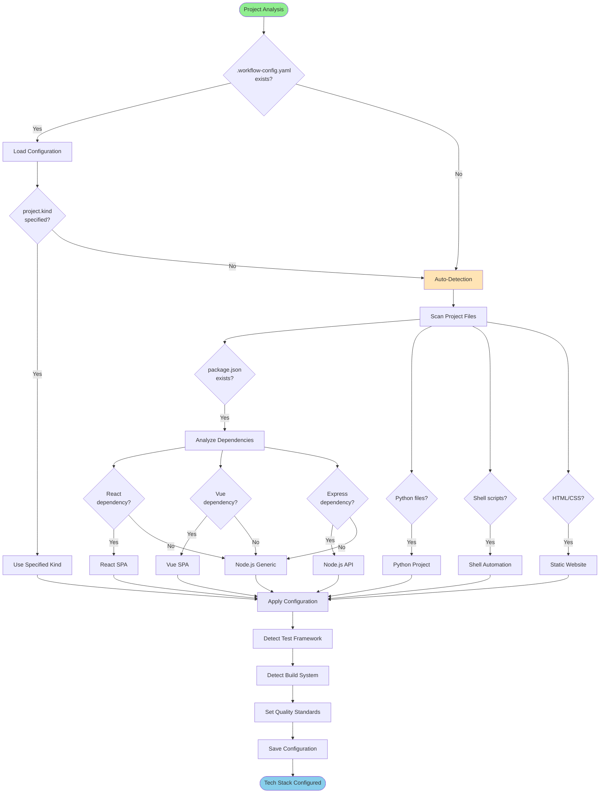

---

## Summary

These diagrams visualize the complex workflows and decision logic in the AI Workflow Automation system:

1. **15-Step Workflow Flow**: Shows the complete sequential execution path
2. **Dependency Relationships**: Illustrates which steps depend on others
3. **Parallel Execution Groups**: Demonstrates 3-track parallelization strategy
4. **Change Detection Logic**: Explains impact classification algorithm
5. **Smart Execution Decision Tree**: Shows step skip logic based on changes
6. **AI Cache Flow**: Visualizes cache lookup, storage, and maintenance
7. **Checkpoint Resume Logic**: Demonstrates automatic workflow continuation
8. **Module Architecture**: Shows the modular structure and relationships

### Quick Reference

| Diagram | Use Case | Key Insight |
|---------|----------|-------------|
| Workflow Flow | Understanding execution order | Sequential: 26 min, Parallel: 15.5 min |
| Dependencies | Identifying critical path | Bottleneck: Step 7 (Test Execution, 240s) |
| Parallel Groups | Optimization opportunities | 33% time savings with 3-track execution |
| Change Detection | Smart execution decisions | 85% faster for documentation-only changes |
| AI Cache | Performance optimization | 60-80% token reduction, 24-hour TTL |
| Checkpoints | Reliability & resume | Automatic continuation from last step |

### Related Documentation

- **Performance Benchmarks**: [PERFORMANCE_BENCHMARKS.md](performance-benchmarks.md)
- **Smart Execution Guide**: [SMART_EXECUTION_GUIDE.md](smart-execution.md)
- **Parallel Execution Guide**: [PARALLEL_EXECUTION_GUIDE.md](parallel-execution.md)
- **AI Cache Configuration**: [AI_CACHE_CONFIGURATION_GUIDE.md](ai-cache-configuration.md)
- **Checkpoint Management**: [CHECKPOINT_MANAGEMENT_GUIDE.md](checkpoint-management.md)
- **Configuration Schema**: [CONFIGURATION_SCHEMA.md](configuration.md)

---

**Document Version**: 2.4.0  
**Last Updated**: 2025-12-23  
**Maintained By**: AI Workflow Automation Team
